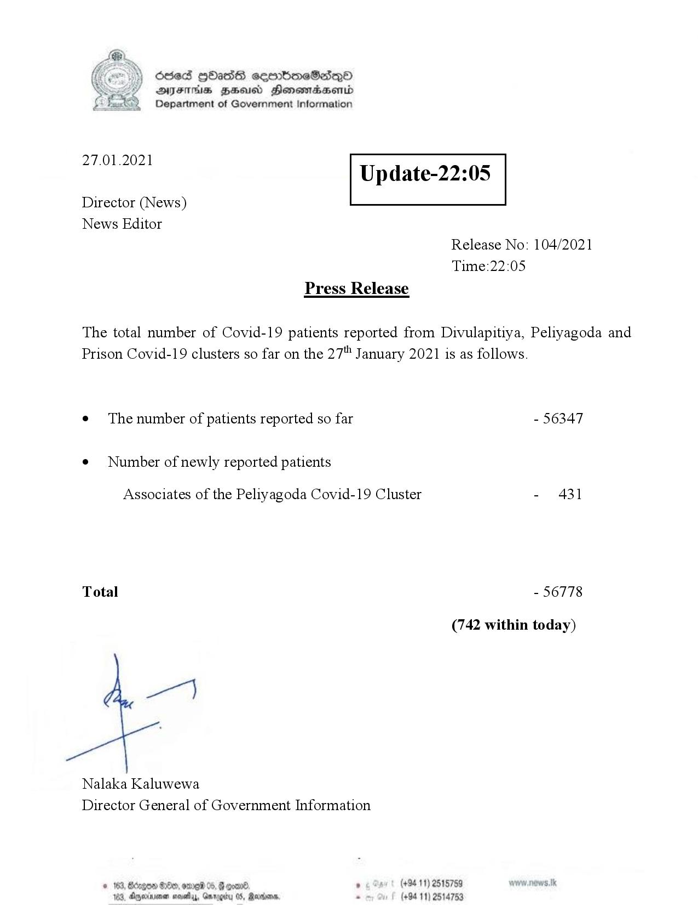

# Press Release - 2021.01.27 
Key: 001157a81ecc5919c273e4db93f85693 

---
```
Ssed HbasG sembmeSadqo
DAIS BHU Honomasentd
Department of Government Information

 

 

27.01.2021

Update-22:05

 

 

 

Director (News)
News Editor
Release No: 104/2021
Time:22:05
Press Release

The total number of Covid-19 patients reported from Divulapitiya, Peliyagoda and
Prison Covid-19 clusters so far on the 27" January 2021 is as follows.
e¢ The number of patients reported so far - 56347

¢ Number of newly reported patients

Associates of the Peliyagoda Covid-19 Cluster - 431

Total - 56778

(742 within today)

ge]

Nalaka Kaluwewa
Director General of Government Information

© 163, Bzgon $8, ome 05, & coan®. , (+84 11) 2515759
103, Ayminuemen novel, Garogity 0, Marden, . (+94 11) 2514753

 

```
