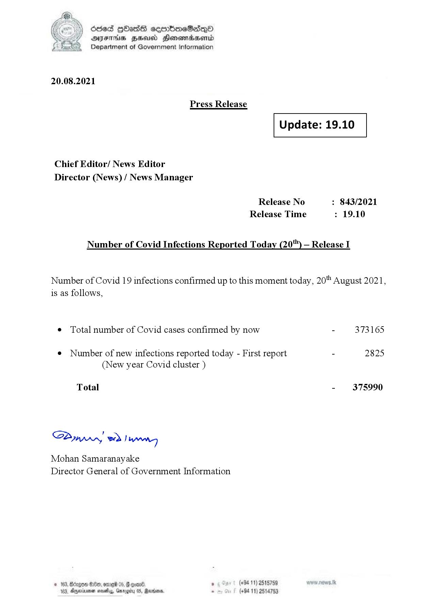

# Press Release - 2021.08.20 
Key: 00a94d92879842351db7c9342891a1be 

---
```
)) died QOadS cemmboeSdqQa
DFS HHS Honsmnadaerntd
Department of Government Information

 

20.08.2021

Press Release

 

Update: 19.10

 

 

 

Chief Editor/ News Editor
Director (News) / News Manager

Release No : 843/2021
Release Time : 19.10

Number of Covid Infections Reported Today (20") — Release I

Number of Covid 19 infections confirmed up to this moment today, 20" August 2021,
is as follows,

¢ Total number of Covid cases confirmed by now - 373165

¢ Number of new infections reported today - First report - 2825
(New year Covid cluster )

Total - 375990

SB, eed | Mens

Mohan Samaranayake
Director General of Government Information

   

188, Anexivenan noes, Garogiy 05, Mardoorn,

```
