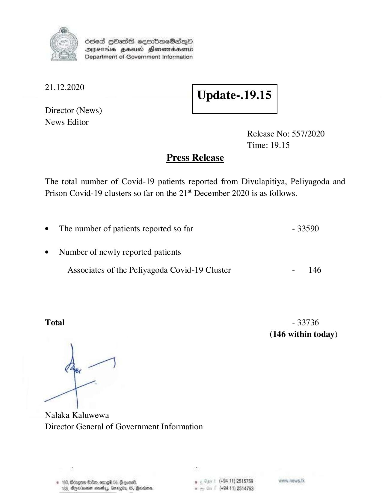

# Press Release - 2020.12.21 
Key: 012b428daaa4adfc786c23a8ed2f4239 

---
```
6563 HOHasG sembmcSasqQo
DAJFITAs BHU Honomrdbsertd
Department of Government Information

 

 

21.12.2020
Update-.19.15

 

 

Director (News)
News Editor

 

Release No: 557/2020
Time: 19.15

Press Release
The total number of Covid-19 patients reported from Divulapitiya, Peliyagoda and
Prison Covid-19 clusters so far on the 21‘ December 2020 is as follows.

¢ The number of patients reported so far - 33590

¢ Number of newly reported patients

Associates of the Peliyagoda Covid-19 Cluster - 146

Total - 33736
(146 within today)

Nalaka Kaluwewa
Director General of Government Information

# 183, Bergen G00, omed 04, GF coat: ° (494.11) 2515759
163, Ageia sve, Grrogiy 05, Marsan, . (+94 11) 2514753

```
