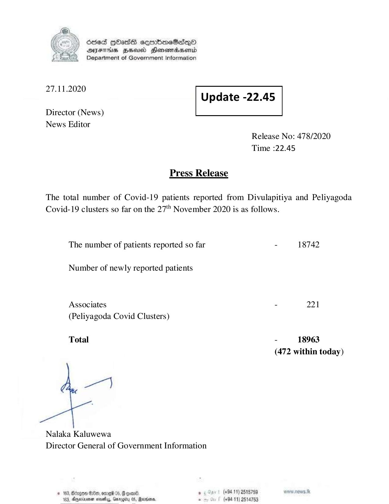

# Press Release - 2020.11.27 
Key: 012ead792420c161b161bea283cff62f 

---
```
6563 HOHasG sembmcSasqQo
DAJFITAs BHU Honomrdbsertd
Department of Government Information

 

 

27.11.2020
Update -22.45

 

 

Director (News)
News Editor

 

Release No: 478/2020
Time :22.45

Press Release
The total number of Covid-19 patients reported from Divulapitiya and Peliyagoda
Covid-19 clusters so far on the 27" November 2020 is as follows.
The number of patients reported so far - 18742
Number of newly reported patients
Associates - 221
(Peliyagoda Covid Clusters)

Total - 18963
(472 within today)

7}

Nalaka Kaluwewa
Director General of Government Information

* 163, Bcogon Ge, ome %, G goad . (+94 11) 2515759 ww. news. tk
123, Oneiarnen sovaby, Grrogity 05, Madan. . (+9411) 2514753

```
