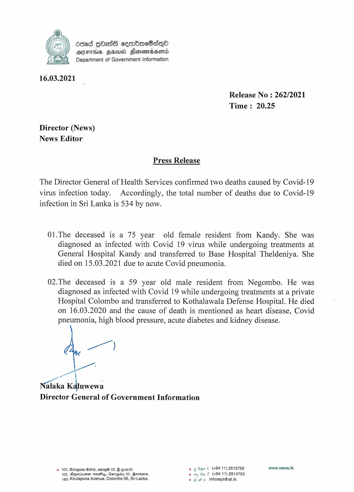

# Press Release - 2021.03.16 - Covid 19 infection deaths 
Key: 01945907bc56f8b3004f78c2bbec471e 

---
```
6868 QOsdG ceorbacOsqQea
AFIHS FEaId Slonemdsomtd
Department of Government Information

 

16.03.2021

Release No : 262/2021
Time: 20.25

Director (News)
News Editor

Press Release

The Director General of Health Services confirmed two deaths caused by Covid-19
virus infection today. Accordingly, the total number of deaths due to Covid-19
infection in Sri Lanka is 534 by now.

01.The deceased is a 75 year old female resident from Kandy. She was
diagnosed as infected with Covid 19 virus while undergoing treatments at
General Hospital Kandy and transferred to Base Hospital Theldeniya. She
died on 15.03.2021 due to acute Covid pneumonia.

02.The deceased is a 59 year old male resident from Negombo. He was
diagnosed as infected with Covid 19 while undergoing treatments at a private
Hospital Colombo and transferred to Kothalawala Defense Hospital. He died
on 16.03.2020 and the cause of death is mentioned as heart disease, Covid
pneumonia, high blood pressure, acute diabetes and kidney disease.

xe)
we"

alaka Chowesl
Director General of Government Information

2 163, BézQna HO, me 05, G Eom. © ¢ Qs t (+9411) 2515759 www.news.lk
163, Dgpmrinsmen sauays, Ganapiby 05, Bourn. 0 oy Gu f (+94 11) 2614753
163, Kirulapona Avenue, Colombo 05, Sri Lanka. © 8 ec infodept@sit.Ik

```
