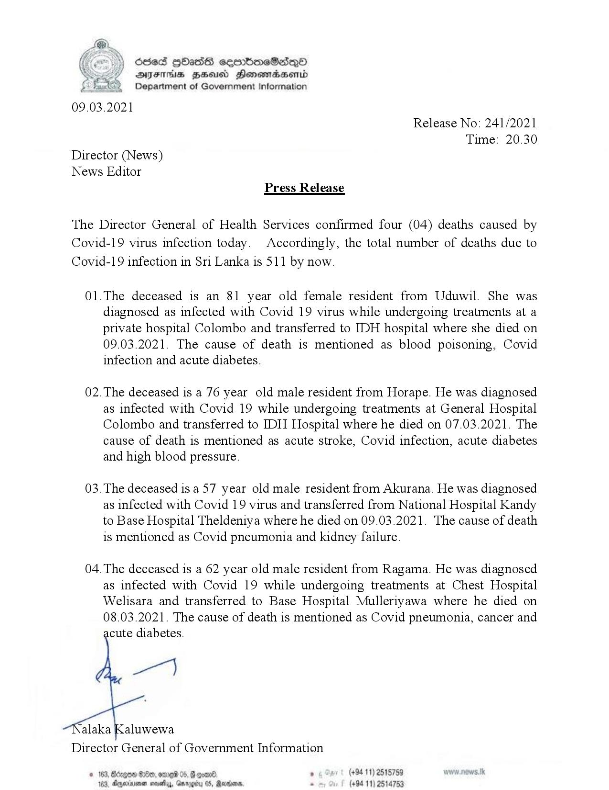

# Press Release - 2021.03.09 - Covid 19 Infection deaths 
Key: 01d8e6c9075e3685e30602c63efc99ad 

---
```
}) SCced GHbasds ceerbmeSedqQo
AFIS BHU Honsmasenid
Department of Government Information

 

09.03.2021
Release No: 241/2021
Time: 20.30
Director (News)
News Editor
Press Release

The Director General of Health Services confirmed four (04) deaths caused by
Covid-19 virus infection today. Accordingly, the total number of deaths due to
Covid-19 infection in Sri Lanka is 511 by now.

01.The deceased is an 81 year old female resident from Uduwil. She was
diagnosed as infected with Covid 19 virus while undergoing treatments at a
private hospital Colombo and transferred to IDH hospital where she died on
09.03.2021. The cause of death is mentioned as blood poisoning, Covid
infection and acute diabetes.

02.The deceased is a 76 year old male resident from Horape. He was diagnosed
as infected with Covid 19 while undergoing treatments at General Hospital
Colombo and transferred to IDH Hospital where he died on 07.03.2021. The
cause of death is mentioned as acute stroke, Covid infection, acute diabetes
and high blood pressure.

03.The deceased isa 57 year old male resident from Akurana. He was diagnosed
as infected with Covid 19 virus and transferred from National Hospital Kandy
to Base Hospital Theldeniya where he died on 09.03.2021. The cause of death
is mentioned as Covid pneumonia and kidney failure.

04. The deceased is a 62 year old male resident from Ragama. He was diagnosed
as infected with Covid 19 while undergoing treatments at Chest Hospital
Welisara and transferred to Base Hospital Mulleriyawa where he died on
08.03.2021. The cause of death is mentioned as Covid pneumonia, cancer and

cute diabetes.

  

(+94 11) 2515789
(+94 11) 2514753

```
