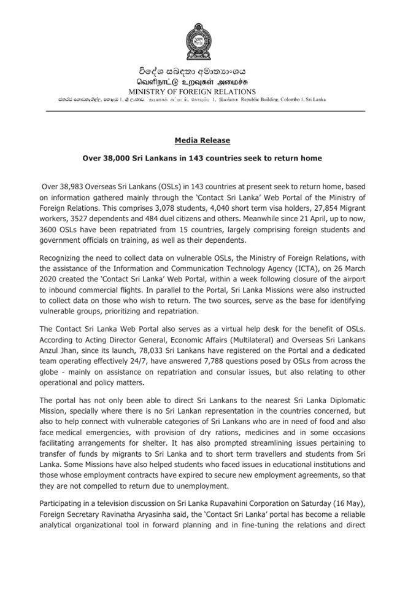

# Press Release - 2020.05.18 - Ministry of Foreign Relations 
Key: 02527d55712f151b7eea245bbee2059c 

---
```
Boda wagm ghosras
Aeuefipm @ emeyscr simoéer
MINISTRY OF FOREIGN RELATIONS
eecvemamete. cons 3ome  bnesh aah nan 1 Beton Ro Mali Cole Ske

 

Media Release

 

‘Over 38,000 Sri Lankans in 143 countries seek to return home

‘Over 38,983 Overseas Sri Lankans (Ss) in 143 countries at present seek to return home, based
on information gathered mainly through the ‘Contact Sri Lanka’ Web Portal of the Ministry of
Foreign Relations. This comprises 3,078 students, 4,040 short term visa holders, 27,854 Migrant
workers, 3527 dependents and 484 duel citizens and others. Meanwhile since 21 April, up to now,
3600 OSLs have been repatriated from 15 countries, largely comprising foreign students and
government officals on training, as well as their dependents.

Recognizing the need to collect data on vulnerable OSL, the Ministry of Foreign Relations, with
the assistance of the Information and Communication Technology Agency (ICTA), on 26 March
2020 created the ‘Contact Sri Lanka’ Web Portal, within a week following closure of the airport
to inbound commercial flights. In parallel to the Portal, Sri Lanka Missions were also instructed
to collect data on those who wish to return. The two sources, serve as the base for identifying
vulnerable groups, prioritizing and repatriation.

 

‘The Contact Sri Lanka Web Portal also serves as a virtual help desk for the benefit of OSts.
According to Acting Director General, Economic Affairs (Multilateral) and Overseas Sri Lankans
Anzul Jhan, since its launch, 78,033 Sri Lankans have registered on the Portal and a dedicated
team operating effectively 24/7, have answered 7,788 questions posed by OSLs from across the
globe - mainly on assistance on repatriation and consular issues, but also relating to other
operational and policy matters.

‘The portal has not only been able to direct Sri Lankans to the nearest Sri Lanka Diplomatic
Mission, specially where there is no Sri Lankan representation in the countries concerned, but
also to help connect with vulnerable categories of Sri Lankans who are in need of food and also
face medical emergencies, with provision of dry rations, medicines and in some occasions
facilitating arrangements for shelter. It has also prompted streamlining issues pertaining to
transfer of funds by migrants to Sri Lanka and to short term travellers and students from Sri
Lanka, Some Missions have also helped students who faced issues in educational institutions and
those whose employment contracts have expired to secure new employment agreements, so that
they are not compelled to return due to unemployment.

Participating in a television discussion on Sri Lanka Rupavahini Corporation on Saturday (16 May),
Foreign Secretary Ravinatha Aryasinha said, the ‘Contact Sri Lanka’ portal has become a reliable
analytical organizational tool in forward planning and in fine-tuning the relations and direct

```
