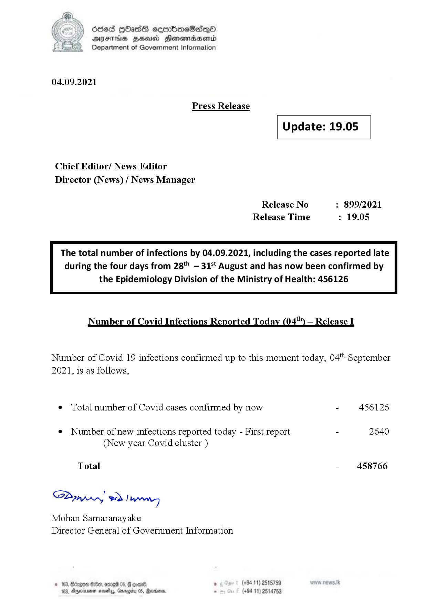

# Press Release - 2021.09.04 
Key: 033c4ad658e8a67fd74626488c59b498 

---
```
6863 GOasds sembmeSadqQo
AIFS HSA Honomasentd
Department of Government Information

 

04.09.2021

Press Release

 

Update: 19.05

 

 

 

Chief Editor/ News Editor
Director (News) / News Manager

Release No : 899/2021
Release Time : 19.05

The total number of infections by 04.09.2021, including the cases reported late
during the four days from 28*" — 315 August and has now been confirmed by

the Epidemiology Division of the Ministry of Health: 456126

 

Number of Covid Infections Reported Today (04") — Release I

Number of Covid 19 infections confirmed up to this moment today, 04" September

2021, is as follows,

¢ Total number of Covid cases confirmed by now - 456126

¢ Number of new infections reported today - First report - 2640
(New year Covid cluster )

- 458766

Total

SPynprwn) wd! wang

Mohan Samaranayake
Director General of Government Information

(+94 11) 2515789
(+94 11) 2514753

 

```
