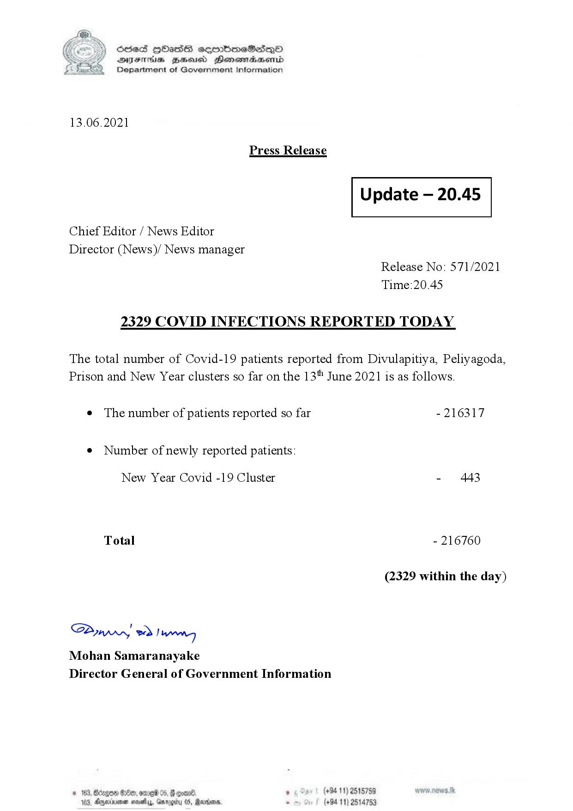

# Press Release - 2021.06.13 - Covid 19 infection report 
Key: 034ac09202eedc67cf601a7eb9c542cd 

---
```
(6 S) ScseS HOasdS cerrbmeSdQo
DFTs BHEosd Henewtaeasernid
Department of Government Information

 

13.06.2021

Press Release

 

Update — 20.45

 

 

 

Chief Editor / News Editor

Director (News)/ News manager
Release No: 571/2021

Time:20.45
2329 COVID INFECTIONS REPORTED TODAY

The total number of Covid-19 patients reported from Divulapitiya, Peliyagoda,
Prison and New Year clusters so far on the 13" June 2021 is as follows.

e The number of patients reported so far - 216317

¢ Number of newly reported patients:

New Year Covid -19 Cluster - 443
Total - 216760
(2329 within the day)

Saw 2) won,
Mohan Samaranayake
Director General of Government Information

© 163, Bdegon G80, ome 0 6 ’ (+94 11) 2515759
163, Agere naethy, Gmrogiby 05, Rereisons, - (+94 11) 2514753

 

```
