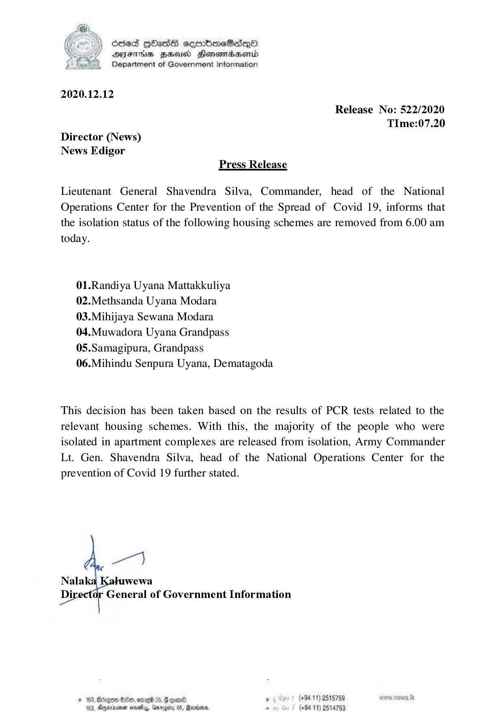

# Press Release - 2020.12.12 
Key: 038e1baa8063899f92e6e6c1f600c4b0 

---
```
686d HHasG sombmeSsqoO
DFTs BHU Honemrdsernd
Department of Government Information

 

2020.12.12

Release No: 522/2020
TIme:07.20
Director (News)
News Edigor
Press Release

Lieutenant General Shavendra Silva, Commander, head of the National
Operations Center for the Prevention of the Spread of Covid 19, informs that
the isolation status of the following housing schemes are removed from 6.00 am
today.

01.Randiya Uyana Mattakkuliya
02.Methsanda Uyana Modara
03.Mihijaya Sewana Modara
04.Muwadora Uyana Grandpass
05.Samagipura, Grandpass

06.Mihindu Senpura Uyana, Dematagoda

This decision has been taken based on the results of PCR tests related to the
relevant housing schemes. With this, the majority of the people who were
isolated in apartment complexes are released from isolation, Army Commander
Lt. Gen. Shavendra Silva, head of the National Operations Center for the
prevention of Covid 19 further stated.

a1

Nala wewa
Di General of Government Information

8. ‘ (+94 11) 2515789
OS, Reaans. . (+94 11) 2514753

# 163, Bcegen 00, onve
104. Ceyediasenen cies,

  

```
