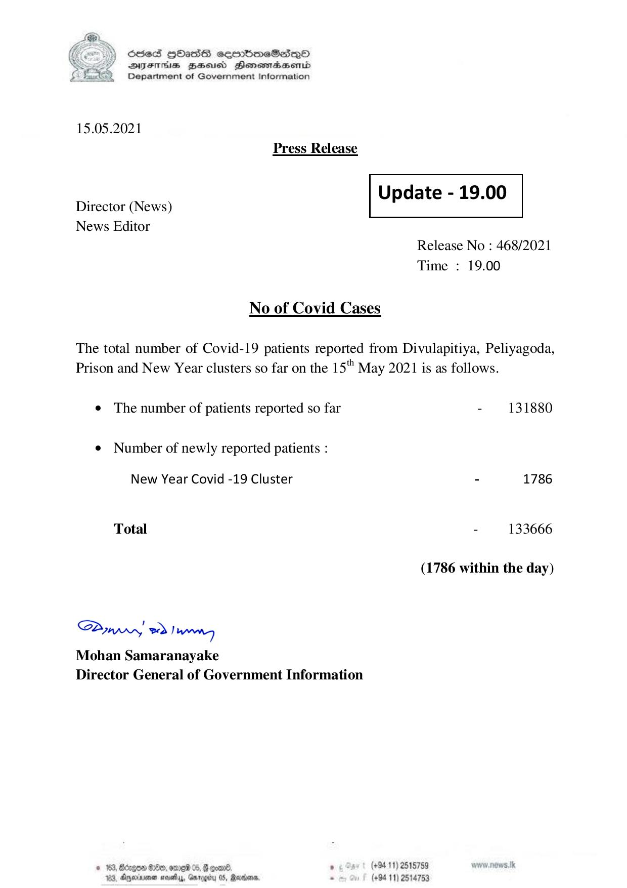

# Press Release - 2021.05.15 
Key: 045ec11734c28d412ed88a6aff3636f8 

---
```
) ScdeS HOadS cermbmeSsdQo
DVEFIHS HHosd Honomabsenid
Department of Government Information

 

15.05.2021
Press Release

 

Update - 19.00

 

Director (News)
News Editor

 

 

Release No : 468/2021
Time : 19.00

No of Covid Cases

The total number of Covid-19 patients reported from Divulapitiya, Peliyagoda,
Prison and New Year clusters so far on the 15" May 2021 is as follows.

¢ The number of patients reported so far - 131880

¢ Number of newly reported patients :

New Year Covid -19 Cluster - 1786
Total - 133666
(1786 within the day)

Saw 2) wong

Mohan Samaranayake
Director General of Government Information

© 162; Bcapo0 €:80, ene 05, 8 cxene ‘ (+94 11) 2518759
163, Ageiune neatly, Gargity 05, Rann. - (+94 11) 2514753

```
