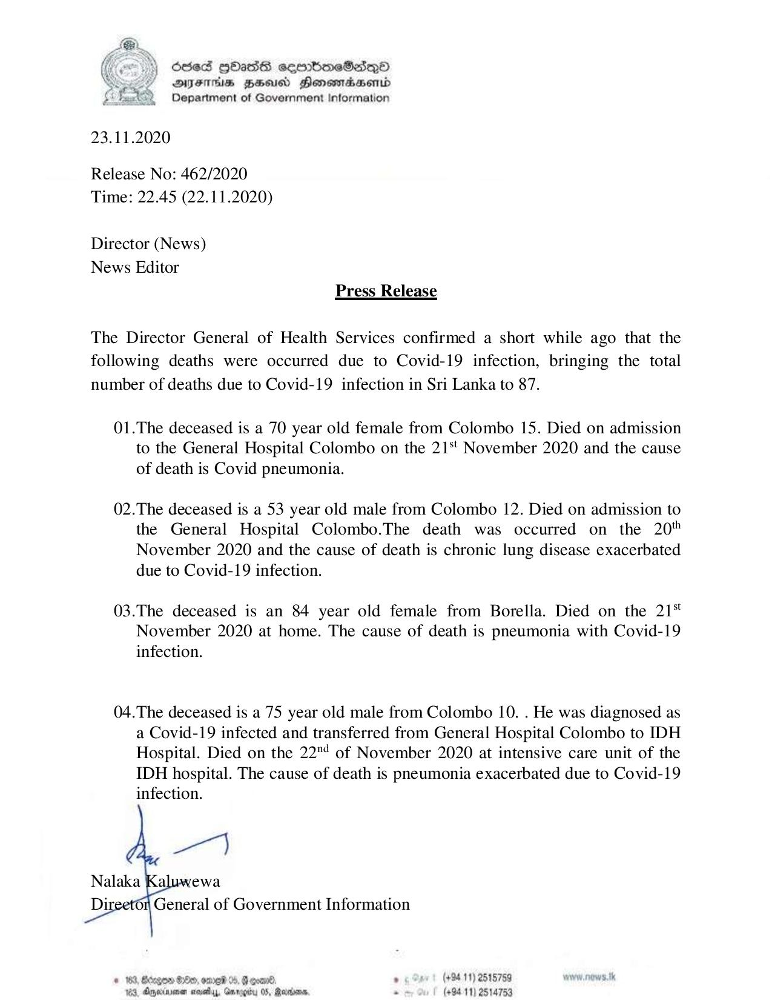

# Press Release - 2020.11.22 - Covid 19 infection death rises to 87 
Key: 04b39744a626126bb04d5981af296541 

---
```
6565 HOAs soembmraeSasqoO
DFAS HEU Honewrdbsernd
Department of Government Information

 

23.11.2020

Release No: 462/2020
Time: 22.45 (22.11.2020)

Director (News)
News Editor
Press Release

The Director General of Health Services confirmed a short while ago that the
following deaths were occurred due to Covid-19 infection, bringing the total
number of deaths due to Covid-19 infection in Sri Lanka to 87.

01.The deceased is a 70 year old female from Colombo 15. Died on admission
to the General Hospital Colombo on the 21‘ November 2020 and the cause
of death is Covid pneumonia.

02.The deceased is a 53 year old male from Colombo 12. Died on admission to
the General Hospital Colombo.The death was occurred on the 20%
November 2020 and the cause of death is chronic lung disease exacerbated
due to Covid-19 infection.

03.The deceased is an 84 year old female from Borella. Died on the 21*
November 2020 at home. The cause of death is pneumonia with Covid-19
infection.

04.The deceased is a 75 year old male from Colombo 10. . He was diagnosed as
a Covid-19 infected and transferred from General Hospital Colombo to IDH
Hospital. Died on the 22"4 of November 2020 at intensive care unit of the
IDH hospital. The cause of death is pneumonia exacerbated due to Covid-19
infection.

 

© 163, Bcegon Ge, omed 4. @ goad , (+9411) 2515759
183, Oxyeriayenen mesedlyy, Gnrogiiu 05, Mantis, “ (+9411) 2514753

```
