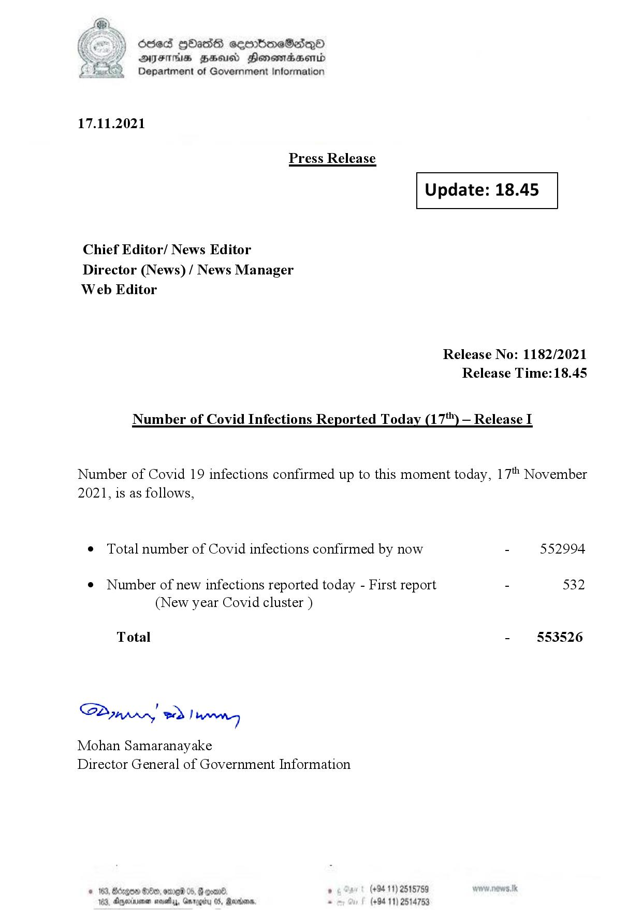

# Press Release - 2021.11.17 
Key: 0561e55bab9d7d4417d715518f0f7cb0 

---
```
L@

(oe) Sed QOass cerrbroeSadqQo
DFS HHS Honsmnadaerntd
Department of Government Information

 

17.11.2021

Press Release

 

Update: 18.45

 

 

 

Chief Editor/ News Editor
Director (News) / News Manager
Web Editor

Release No: 1182/2021
Release Time:18.45

Number of Covid Infections Reported Today (17) — Release I

Number of Covid 19 infections confirmed up to this moment today, 17" November
2021, is as follows,

¢ Total number of Covid infections confirmed by now - 552994

¢ Number of new infections reported today - First report - 532
(New year Covid cluster )

Total - 553526

Sa mprn! wd! wong

Mohan Samaranayake
Director General of Government Information

ant 5 (+94 11) 2515789
05, Rana. - (+84 11) 25

 
 

© 163, Bdrgon Ge, ome 05, F
163, Aparna sosehyy, Gnr

  

```
