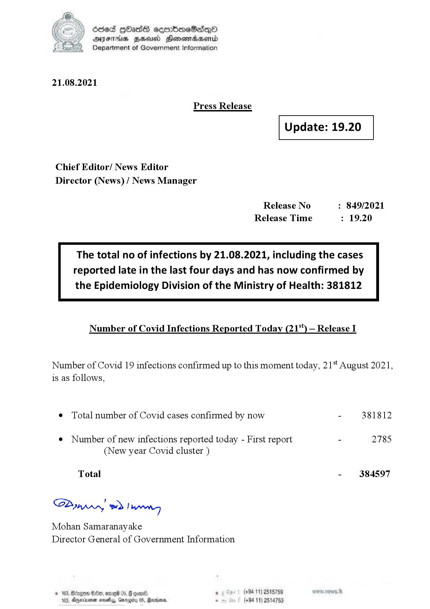

# Press Release - 2021.08.21 
Key: 0597994d5f6aa7ea263bf285cb297686 

---
```
6863 GOasds sembmeSadqQo
AIFS HSA Honomasentd
Department of Government Information

 

21.08.2021

Press Release

 

Update: 19.20

 

 

 

Chief Editor/ News Editor
Director (News) / News Manager

Release No : 849/2021
Release Time : 19.20

The total no of infections by 21.08.2021, including the cases
reported late in the last four days and has now confirmed by

the Epidemiology Division of the Ministry of Health: 381812

 

Number of Covid Infections Reported Today (21*) — Release I

Number of Covid 19 infections confirmed up to this moment today, 21 August 2021,
is as follows,

¢ Total number of Covid cases confirmed by now - 381812

¢ Number of new infections reported today - First report - 2785
(New year Covid cluster )

Total - 384597

Sa mprn! wd! beng

Mohan Samaranayake
Director General of Government Information

. (+94 11) 2515759
(+94 11) 2514753

 

```
