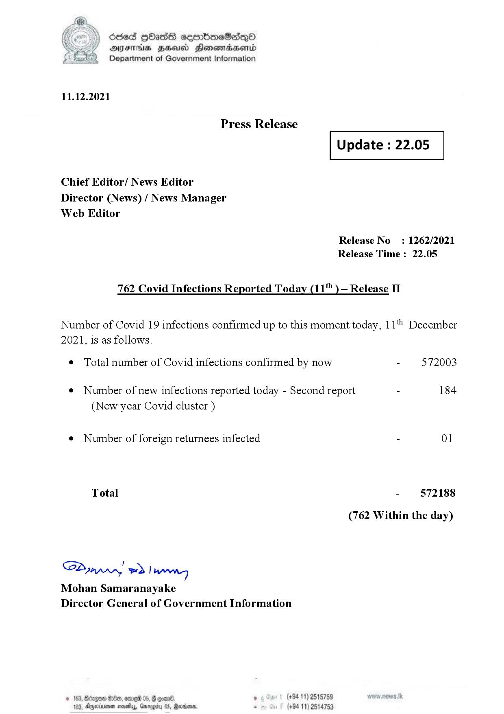

# Press Release - 2021.12.11 
Key: 070db9754ab96bd9b0f82fa586947cdb 

---
```
dosed GOass eemmbmeSadepO
DFS BHU Honswnradasentd
Department of Government Information

 

 

11.12.2021

Press Release

 

Update : 22.05

 

 

 

Chief Editor/ News Editor
Director (News) / News Manager
Web Editor

Release No: 1262/2021
Release Time : 22.05

762 Covid Infections Reported Today (11 )— Release II

Number of Covid 19 infections confirmed up to this moment today, 11" December
2021, is as follows.

¢ Total number of Covid infections confirmed by now - 572003

¢ Number of new infections reported today - Second report - 184
(New year Covid cluster )

¢ Number of foreign returnees infected - 01
Total - 572188
(762 Within the day)

SP nprrn wd Ianwng
Mohan Samaranayake
Director General of Government Information

(+94 11) 2515759
(+94 11) 2514753

GOD 100, omg 05
Doyerinsonen snevetyy, Garo

   

```
