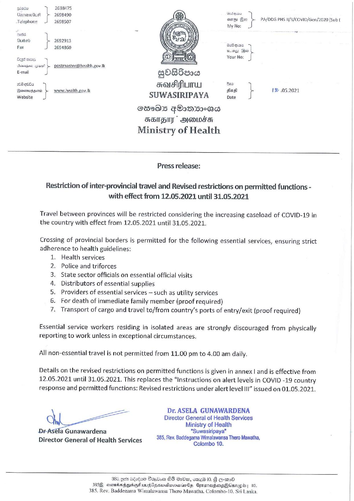

# Press Release - 2021.05.12 - Restriction of inter - provincial travel and Revised restrictions on permitted functions with effect from 12.05.2021 until 31.05.2021 
Key: 072e5e7101f7176f142f16375a7ffc63 

---
```
   

2698475
stand) 2698490

 

 

   

7 ana By PA/DDG PHS I1/3/COVID/Gen/2020 (Sub ¢

Telephone 2698507 eke
a
Quéerd L 2692913 ee «
Fax J 26s4860 sibel oe. |

Your No: i

postmaster@health.gov.tk
QOBSea00

eon f srousifiumuy = A } 1® 05,2021
Boomugon b  www-health.cov.k sag 05.
Website SUWASIRIPAYA Date

Ses9MS FOoMs20@d
FSTBIT  BEOOEH
Ministry of Health

 

Press release:

Restriction of inter-provincial travel and Revised restrictions on permitted functions -
with effect from 12.05.2021 until 31.05.2021

Travel between provinces will be restricted considering the increasing caseload of COVID-19 in
the country with effect from 12.05.2021 until 31.05.2021.

Crossing of provincial borders is permitted for the following essential services, ensuring strict
adherence to health guidelines:

1. Health services

Police and triforces

State sector officials on essential official visits

Distributors of essential supplies

Providers of essential services — such as utility services

For death of immediate family member (proof required)

Transport of cargo and travel to/from country’s ports of entry/exit (proof required)

NOUSwWH

Essential service workers residing in isolated areas are strongly discouraged from physically
reporting to work unless in exceptional circumstances.

All non-essential travel is not permitted from 11.00 pm to 4.00 am daily.

Details on the revised restrictions on permitted functions is given in annex | and is effective from
12.05.2021 until 31.05.2021. This replaces the “Instructions on alert levels in COVID -19 country
response and permitted functions: Revised restrictions under alert level III” issued on 01.05.2021.

Dr. ASELA GUNAWARDENA
Director General of Health Services
Ministry of Health

Dr Asela Gunawardena "“Suwasiripaya"

i a 385, Rev. Baddegama Wimalawansa Thero Mawatha,
Director General of Health Services Colombo 10.

 

 

 

sfad Bvetioa G8 Ode, omed 10. § GomO
385Q crane bance LUFC owoalwwoumsds CyroradhoosGACsragio| 10.
385. Rev. Baddegama Wimalawansa Thero Mawatha. Colombo-10. Sri Lanka.

```
