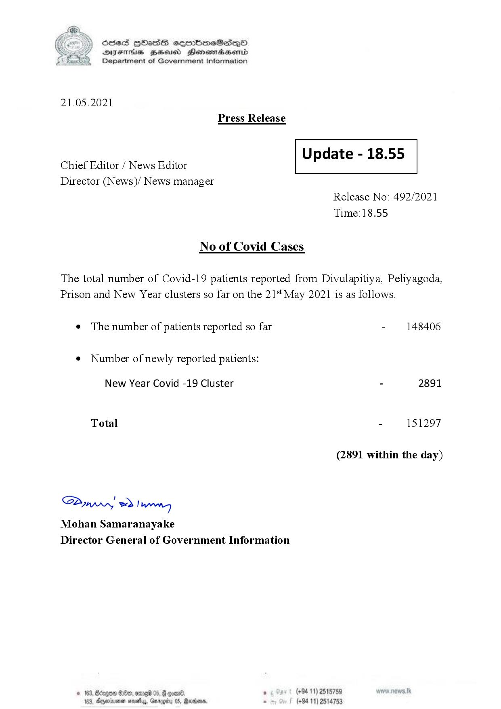

# Press Release - 2021.05.21 
Key: 076c1994d41d4b5ca2efcd091db59259 

---
```
S) ScseS HOasdS cerrbmeSdQo
SVsThis geod Henssnadasombd
Department of Government Information

 

21.05.2021

Press Release

 

a Update - 18.55
Chief Editor / News Editor

Director (News)/ News manager

 

 

 

Release No: 492/2021
Time:18.55

No of Covid Cases

The total number of Covid-19 patients reported from Divulapitiya, Peliyagoda,
Prison and New Year clusters so far on the 21% May 2021 is as follows.

¢ The number of patients reported so far - 148406

¢ Number of newly reported patients:

New Year Covid -19 Cluster - 2891

Total - 151297
(2891 within the day)
Saw 2) wn

Mohan Samaranayake
Director General of Government Information

 

3, GHx, one 05, | com . (+94 11) 2515789
184, Aparna nae, Gmrogity 05, Rertoons, - (+94 11) 2514753

 

```
