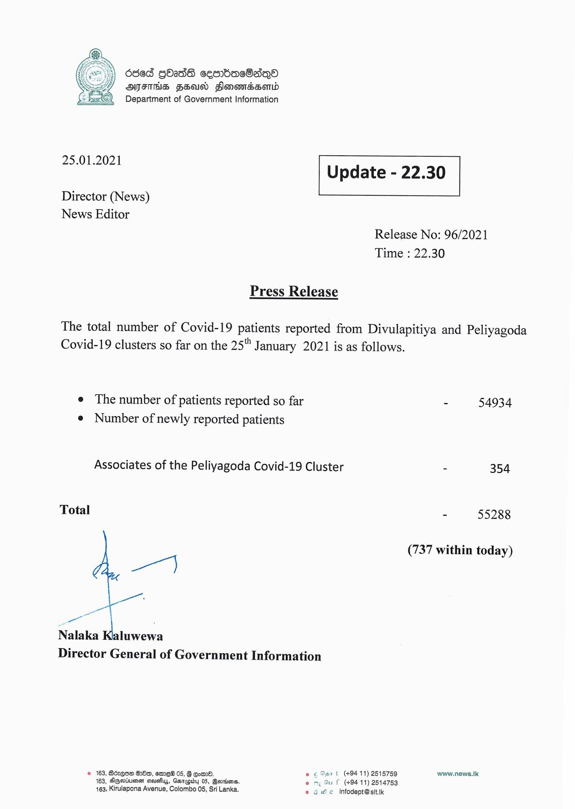

# Press Release - 2021.01.25 
Key: 0770583550ebf97c6211a8854a7cf024 

---
```
Oded GOads cesrbacS8aqQo
AYTETHS FEUD Sonomadsomd
Department of Government Information

 

 

25.01.2021 Update - 22.30

 

 

 

Director (News)
News Editor

Release No: 96/2021
Time : 22.30

Press Release

 

The total number of Covid-19 patients reported from Divulapitiya and Peliyagoda
Covid-19 clusters so far on the 25" January 2021 is as follows.

e The number of patients reported so far - 54934
e Number of newly reported patients

Associates of the Peliyagoda Covid-19 Cluster - 354

Total 55288

(737 within today)

a)

4

ae ~
Nalaka Katuwews
Director General of Government Information

© 163, Adres 82m, eme® 05, 8 Com. og Art
163, Agsiumen ceusfiys, Gsnapiby 05, Bertins. . F (+94 11) 2514753
163, Kirulapona Avenue, Colombo 05, Sri Lanka. © 9 We infodept@sit.ik

(+94 11) 2515759 www.news.Ik

 

```
