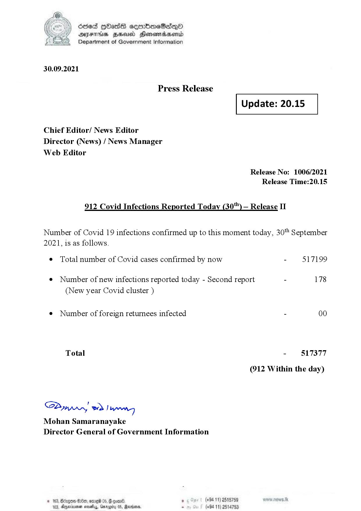

# Press Release  - 2021.09.30 - Covid 19 Infection Report 
Key: 079bdd7d988c7af5e485e5c5f3e09080 

---
```
dosed GOass eemmbmeSadepO
DFS BHU Honswnradasentd
Department of Government Information

 

 

30.09.2021

Press Release

Chief Editor/ News Editor
Director (News) / News Manager
Web Editor

 

 

Update: 20.15

 

 

Release No: 1006/2021
Release Time:20.15

912 Covid Infections Reported Today (30) — Release II

Number of Covid 19 infections confirmed up to this moment today, 30 September

2021, is as follows.

¢ Total number of Covid cases confirmed by now

¢ Number of new infections reported today - Second report

(New year Covid cluster )

¢ Number of foreign returnees infected

Total

Saar eed } hang
Mohan Samaranayake
Director General of Government Information

© 163,

 

0eb, 019 05, 6 eon®. ° (+94 11) 2518759
163, Ageia sasty, Garogiy 05, Ravana - (+94 11) 2514753

- 517199

178

- 817377
(912 Within the day)

```
