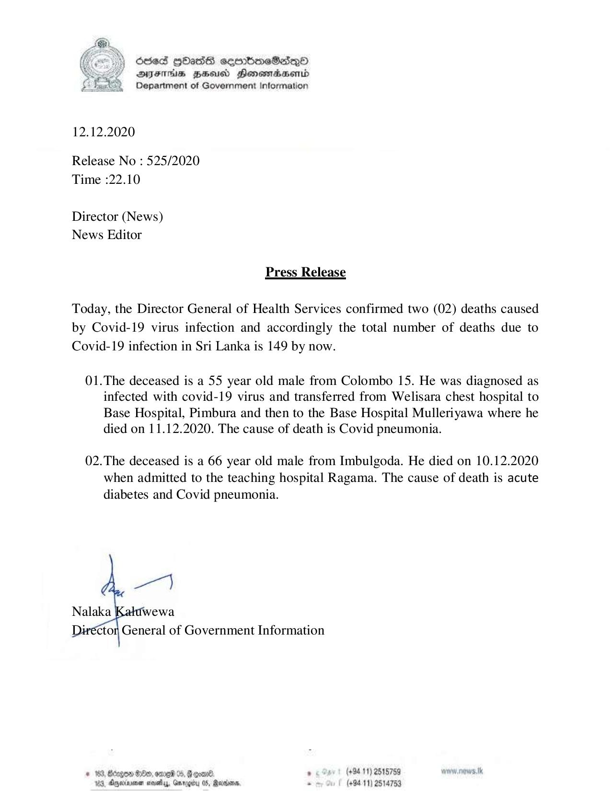

# Press Release - 2020.12.12 - Covid 19 infection deaths rises to 149 
Key: 07f1a5f280a270c1f2eb0d4032b75ed3 

---
```
O8eS Hbass sembmeSadqQnD
DAYFTHs BHU Honomidaserid
Department of Government Information

 

12.12.2020

Release No : 525/2020
Time :22.10

Director (News)
News Editor

Press Release

Today, the Director General of Health Services confirmed two (02) deaths caused
by Covid-19 virus infection and accordingly the total number of deaths due to
Covid-19 infection in Sri Lanka is 149 by now.

01.The deceased is a 55 year old male from Colombo 15. He was diagnosed as
infected with covid-19 virus and transferred from Welisara chest hospital to
Base Hospital, Pimbura and then to the Base Hospital Mulleriyawa where he
died on 11.12.2020. The cause of death is Covid pneumonia.

02.The deceased is a 66 year old male from Imbulgoda. He died on 10.12.2020
when admitted to the teaching hospital Ragama. The cause of death is acute
diabetes and Covid pneumonia.

pe}

Nalaka wewa
‘ctor General of Government Information

# 183, Bergen 800, ome 0, Feoan®. . (+84 11) 2515759
169, Opedvmen nevada, Garegy 05, Sends. . (+9411) 2514753

```
