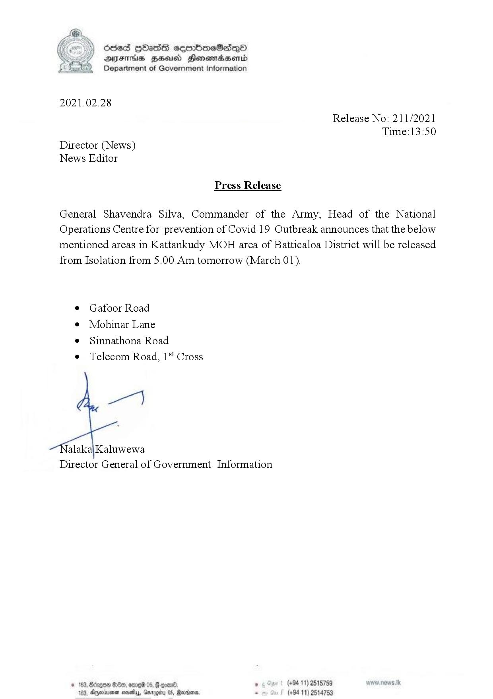

# Press Release - 2021.02.28 - Several areas in Batticaloa District will be released from Isolation from 5 a.m. tomorrow 
Key: 0800861c93fb547daa867dfdb7a0edf1 

---
```
6sed gHass cembmeSasqQo
AIFS BHU Honsmasenid
Department of Government Information

 

2021.02.28

Release No: 211/2021
Time:13:50
Director (News)
News Editor

Press Release

General Shavendra Silva, Commander of the Army, Head of the National
Operations Centre for prevention of Covid 19 Outbreak announces that the below
mentioned areas in Kattankudy MOH area of Batticaloa District will be released
from Isolation from 5.00 Am tomorrow (March 01).

© Gafoor Road

¢ Mohinar Lane

e Sinnathona Road

e Telecom Road, 1* Cross

we)

alaka|Kaluwewa
Director General of Government Information

© 163, Bdegow 8, ore 05, B coand . (+94 11) 2515759
123, Ayminenen novel, Gnrogity 05, Randers. . (+94 11) 2514753

```
