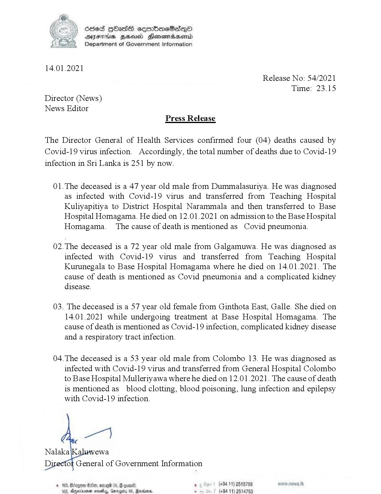

# Press Release - 2021.01.14 - 04 Covid 19 infection deaths has been reported,total number of deaths rises to 251 
Key: 08f32758317688a60c4c12922455f935 

---
```
(Ce) Scsed QOass eeerboeS2deqQ®
SY DYFIHs FS Honsmaesenid
Department of Government Information

 

14.01.2021
Release No: 54/2021
Time: 23.15
Director (News)
News Editor
Press Release

The Director General of Health Services confirmed four (04) deaths caused by
Covid-19 virus infection. Accordingly, the total number of deaths due to Covid-19
infection in Sri Lanka is 251 by now.

01.The deceased is a 47 year old male from Dummalasuriya. He was diagnosed
as infected with Covid-19 virus and transferred from Teaching Hospital
Kultyapitiya to District Hospital Narammala and then transferred to Base
Hospital Homagama. He died on 12.01.2021 on admission to the Base Hospital
Homagama. The cause of death is mentioned as Covid pneumonia.

02.The deceased is a 72 year old male from Galgamuwa. He was diagnosed as
infected with Covid-19 virus and transferred from Teaching Hospital
Kurunegala to Base Hospital Homagama where he died on 14.01.2021. The
cause of death is mentioned as Covid pneumonia and a complicated kidney
disease.

03. The deceased is a 57 year old female from Ginthota East, Galle. She died on
14.01.2021 while undergoing treatment at Base Hospital Homagama. The
cause of death is mentioned as Covid-19 infection, complicated kidney disease
and a respiratory tract infection.

04. The deceased is a 53 year old male from Colombo 13. He was diagnosed as
infected with Covid-19 virus and transferred from General Hospital Colombo
to Base Hospital Mulleriyawa where he died on 12.01.2021. The cause of death
is mentioned as_ blood clotting, blood poisoning, lung infection and epilepsy
with Covid-19 infection.

(+94 11) 2515759
(+94 11) 2514753

 

```
