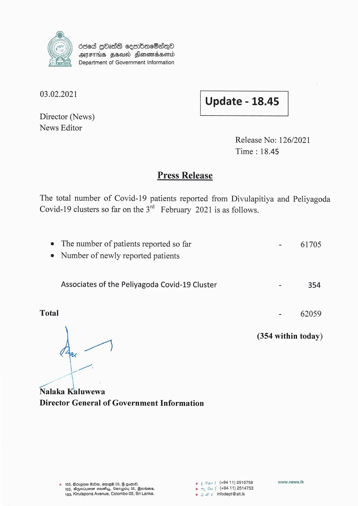

# Press Release - 2021.02.03 
Key: 08fda2af9d7ea0714a4d050b109708ce 

---
```
636d GOIdS cesnbaeOsQO
AITHS SHUN FlonowmessoMLd
Department of Government Information

 

 

03.02.2021 Update - 18.45

 

 

 

Director (News)
News Editor

Release No: 126/2021
Time : 18.45

Press Release

The total number of Covid-19 patients reported from Divulapitiya and Peliyagoda
Covid-19 clusters so far on the 3 February 2021 is as follows.

e The number of patients reported so far - 61705

e Number of newly reported patients
Associates of the Peliyagoda Covid-19 Cluster - 354
Total - 62059

| 44 (354 within today)
eae
a

re.
Nalaka Kaluwewa
Director General of Government Information

© 163, Boxes 68m, eer 05, § Go. © 6 Sart (+9411) 2515759 www.news.Ik
163, SGertumen sisuehys, Garagby 05, erties. em Gu f (+9411) 2514753
163, Kirulapona Avenue, Colombo 05, Sri Lanka. e 5 e infodept@sit.k

```
