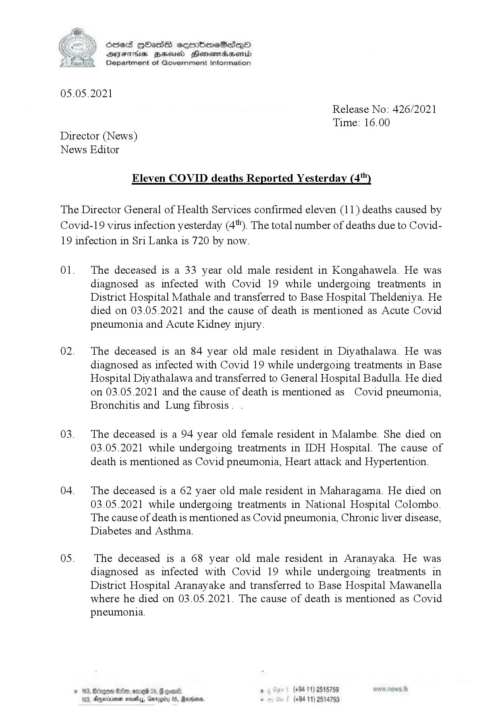

# Press Release - 2021.05.05 - Covid 19 infection deaths( 2021.05.04) 
Key: 0916b5963f3e327d99a6034ce63790a5 

---
```
 

} Oeed HbHass ceembmeSas—Qo
DIF Bud Henemadasend
Department of Government Information

05.05.2021

Release No: 426/2021
Time: 16.00

Director (News)
News Editor

Eleven COVID deaths Reported Yesterday (4)

The Director General of Health Services confirmed eleven (11) deaths caused by

Covid-19 virus infection yesterday (4"). The total number of deaths due to Covid-
19 infection in Sri Lanka is 720 by now.

01.

02.

03.

04.

0S.

 

 

2, Ancinme nowy, Groby 05, Rartions

The deceased is a 33 year old male resident in Kongahawela. He was
diagnosed as infected with Covid 19 while undergoing treatments in
District Hospital Mathale and transferred to Base Hospital Theldeniya. He
died on 03.05.2021 and the cause of death is mentioned as Acute Covid
pneumonia and Acute Kidney injury.

The deceased is an 84 year old male resident in Diyathalawa. He was
diagnosed as infected with Covid 19 while undergoing treatments in Base
Hospital Diyathalawa and transferred to General Hospital Badulla. He died
on 03.05.2021 and the cause of death is mentioned as Covid pneumonia,
Bronchitis and Lung fibrosis. .

The deceased is a 94 year old female resident in Malambe. She died on
03.05.2021 while undergoing treatments in IDH Hospital. The cause of
death is mentioned as Covid pneumonia, Heart attack and Hypertention.

The deceased is a 62 yaer old male resident in Maharagama. He died on
03.05.2021 while undergoing treatments in National Hospital Colombo.
The cause of death is mentioned as Covid pneumonia, Chronic liver disease,
Diabetes and Asthma.

The deceased is a 68 year old male resident in Aranayaka. He was
diagnosed as infected with Covid 19 while undergoing treatments in
District Hospital Aranayake and transferred to Base Hospital Mawanella
where he died on 03.05.2021. The cause of death is mentioned as Covid
pneumonia.

 
 

Srgoe B80, ome 0

 

```
