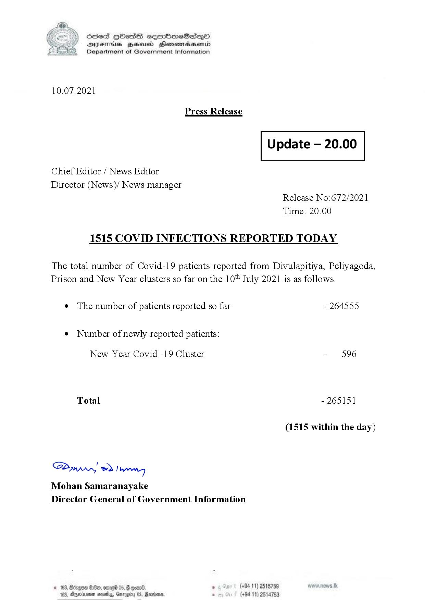

# Press Release - 2021.07.10 - Covid 19 inection report 
Key: 09ac291827985ba15f1d86a7c3a41e84 

---
```
(6 S) ScseS HOasdS cerrbmeSdQo
DFTs BHEosd Henewtaeasernid
Department of Government Information

 

10.07.2021

Press Release

 

Update — 20.00

 

 

 

Chief Editor / News Editor

Director (News)/ News manager
Release No:672/2021

Time: 20.00
1515 COVID INFECTIONS REPORTED TODAY

The total number of Covid-19 patients reported from Divulapitiya, Peliyagoda,
Prison and New Year clusters so far on the 10" July 2021 is as follows.

e The number of patients reported so far - 264555

¢ Number of newly reported patients:

New Year Covid -19 Cluster - 596
Total - 265151
(1515 within the day)

Saw 2) won,
Mohan Samaranayake
Director General of Government Information

© 163, Bdegon G80, ome 0 6 ’ (+94 11) 2515759
163, Agere naethy, Gmrogiby 05, Rereisons, - (+94 11) 2514753

 

```
