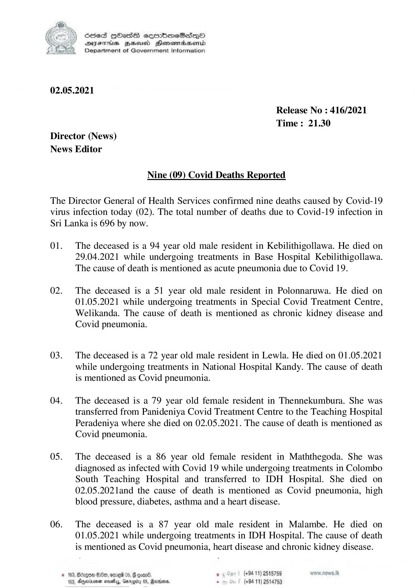

# Press Release - 2021.05.02 - Covid 19 infection deaths 
Key: 0a044e907e2c6df916072d801d4bdac0 

---
```
NY Scdes HhasS coorbmeSedqQoO
DFTs BHEosd Henewtaeasernid
Department of Government Information

 

02.05.2021

Release No : 416/2021
Time: 21.30
Director (News)
News Editor

Nine (09) Covid Deaths Reported

The Director General of Health Services confirmed nine deaths caused by Covid-19
virus infection today (02). The total number of deaths due to Covid-19 infection in
Sri Lanka is 696 by now.

01. The deceased is a 94 year old male resident in Kebilithigollawa. He died on
29.04.2021 while undergoing treatments in Base Hospital Kebilithigollawa.
The cause of death is mentioned as acute pneumonia due to Covid 19.

02. The deceased is a 51 year old male resident in Polonnaruwa. He died on
01.05.2021 while undergoing treatments in Special Covid Treatment Centre,
Welikanda. The cause of death is mentioned as chronic kidney disease and
Covid pneumonia.

03. The deceased is a 72 year old male resident in Lewla. He died on 01.05.2021
while undergoing treatments in National Hospital Kandy. The cause of death
is mentioned as Covid pneumonia.

04. The deceased is a 79 year old female resident in Thennekumbura. She was
transferred from Panideniya Covid Treatment Centre to the Teaching Hospital
Peradeniya where she died on 02.05.2021. The cause of death is mentioned as
Covid pneumonia.

05. The deceased is a 86 year old female resident in Maththegoda. She was
diagnosed as infected with Covid 19 while undergoing treatments in Colombo
South Teaching Hospital and transferred to IDH Hospital. She died on
02.05.2021and the cause of death is mentioned as Covid pneumonia, high
blood pressure, diabetes, asthma and a heart disease.

06. The deceased is a 87 year old male resident in Malambe. He died on
01.05.2021 while undergoing treatments in IDH Hospital. The cause of death
is mentioned as Covid pneumonia, heart disease and chronic kidney disease.

© 163, Bdzgon 00, ome 05, & con®. » 5 Sart (494 11) 2515759
103, Ageia neve, Garg 05, Rares, - (+94 11) 2514753

```
