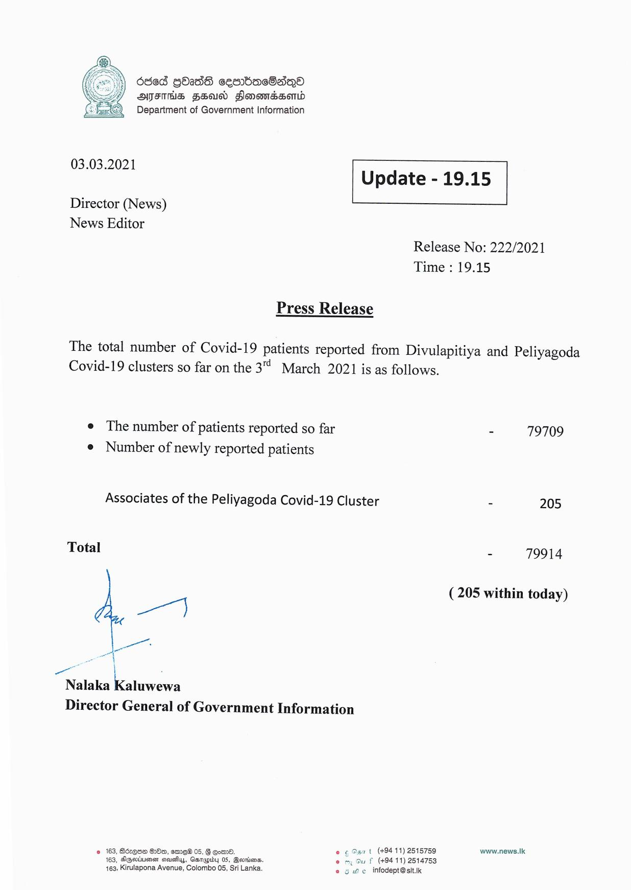

# Press Release - 2021.03.03 
Key: 0a3e1d9b34d99cd684f3bca4651b689f 

---
```
686d GOAdS cesrbacBsQo
DFS FSU Fonondsond
Department of Government Information

 

 

03.03.2021 Update - 19.15
Director (News)

News Editor

Release No: 222/2021
Time : 19.15

Press Release

The total number of Covid-19 patients reported from Divulapitiya and Peliyagoda

Covid-19 clusters so far on the 3 March 2021 is as follows.

e The number of patients reported so far
e Number of newly reported patients

Associates of the Peliyagoda Covid-19 Cluster

Total

a

we ac
al \
Nalaka Kaluwewa

Director General of Government Information

   

2 163, Bzqom 88m, emreH 05, G Cord. © ¢ Sant (49411) 2515759
163, Dgeriuisn steusiuy, Gzrupiby 03, Beriens. * f (+9411) 2514753
163, Kirulapona Avenue, Colombo 05, Sri Lanka. © 6 We. infodept@st.ik

- 79709

= 205

- 79914

(205 within today)

vaww.news.Ik

```
