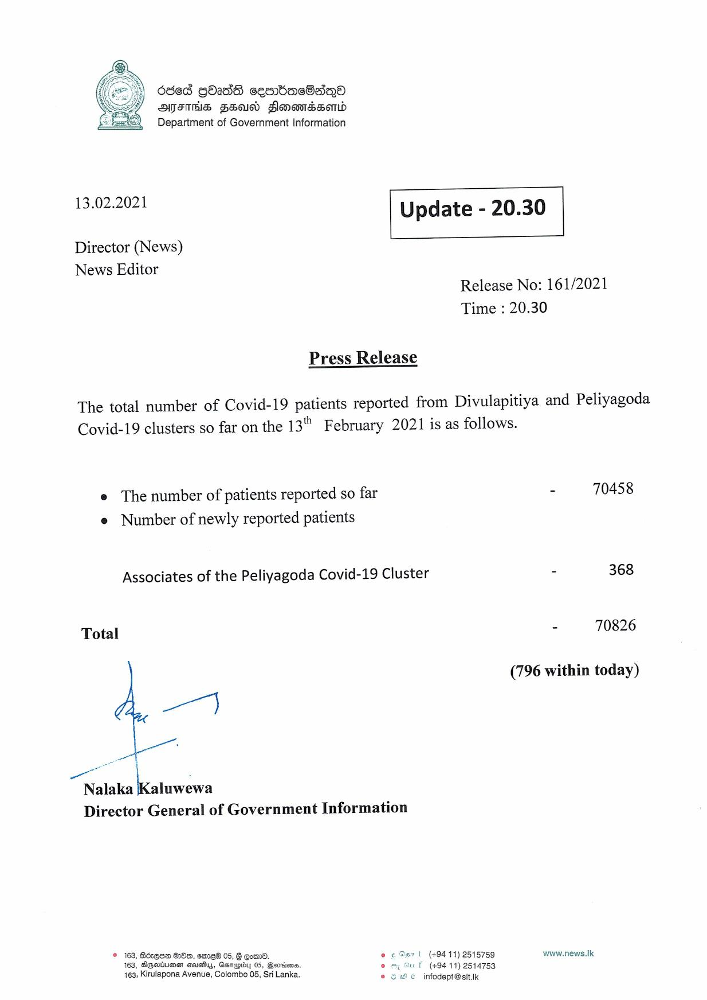

# Press Release - 2021.02.13 
Key: 0a873d1de8ad4ff078cc2ec24a2affc0 

---
```
6863 GOAdS cesnbac8sqoa
AFIS FSD Slonowmdsomd
Department of Government Information

 

 

13.02.2021

 

Update - 20.30

 

 

Director (News)
News Editor

Release No: 161/2021
Time : 20.30

Press Release

The total number of Covid-19 patients reported from Divulapitiya and Peliyagoda
Covid-19 clusters so far on the 13" February 2021 is as follows.

e The number of patients reported so far
e Number of newly reported patients

Associates of the Peliyagoda Covid-19 Cluster

Total
as
Nalaka [Kaluwewa

Director General of Government Information

© 163, Bdrqoe Oo, em 05, § om, Oar t (+94 11) 25157:
; oe Dart 59
163, SGwvinesn siovsiiys, Gasrupiby 05, Garrisons. rf (49441) 2514753

Saat
463, Kirulapona Avenue, Colombo 05, Sri Lanka. © Se infodeptesitik

 

- 70458

= 368

- 70826

(796 within today)

www.news.Ik

```
