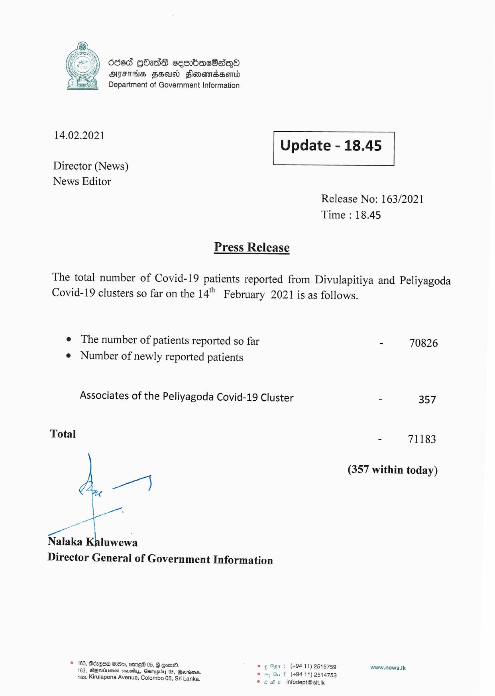

# Press Release - 2021.02.14 
Key: 0a96352db495f5b66f7141cf1de3b9e5 

---
```
686d GOs sembracOaqod
ATFTHS FEU Slonomaesonid
Department of Government Information

 

 

14.02.2021 Update - 18.45

 

 

 

Director (News)

News Editor
Release No: 163/2021
Time : 18.45

Press Release

The total number of Covid-19 patients reported from Divulapitiya and Peliyagoda
Covid-19 clusters so far on the 14" February 2021 is as follows.

e The number of patients reported so far - 70826
e Number of newly reported patients

Associates of the Peliyagoda Covid-19 Cluster - 357

Total - 71183

(357 within today)

wr]

—.
Nalaka Kaluwewa
Director General of Government Information

© 163, Boxgoe Gm, ere 05, G eomn8. € Oa7 t (+94 11) 2515759 www.news.k
163, Aepsviuien steusfiys, Gsnapidy 05, Bertin. F (+94 11) 2514753
163, Kirulapona Avenue, Colombo 05, Sri Lanka. © ewe infodept@stt.ik

 

```
