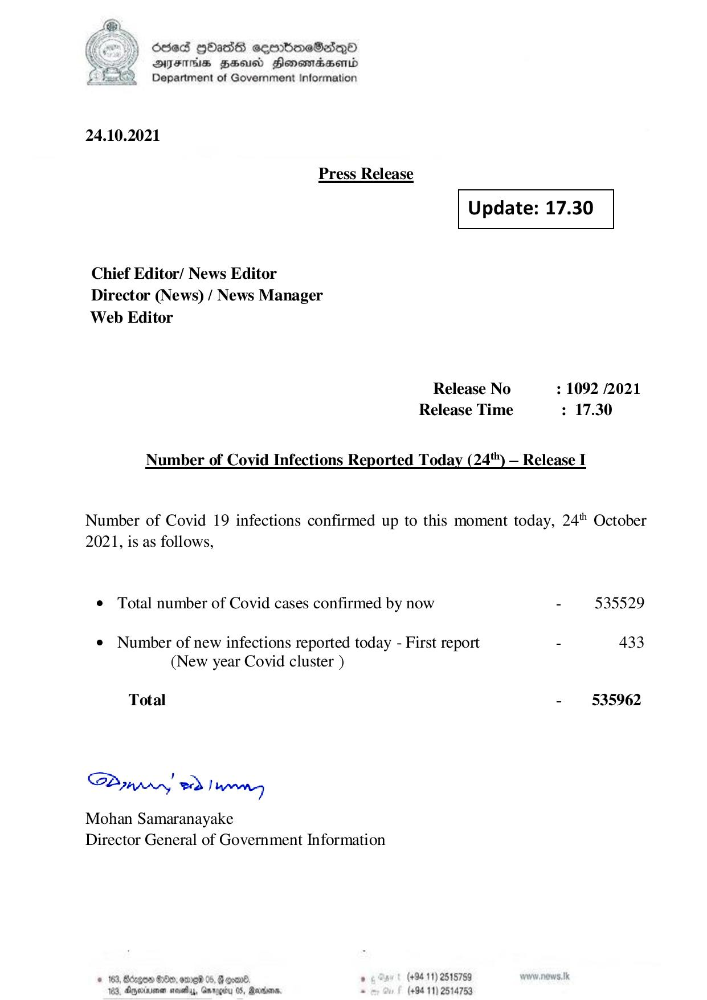

# Press Release - 2021.10.24 
Key: 0a9d72b2a49b217bb0cfb5f66b7d0cb3 

---
```
) dcded QOadS seenBboeSiqQo
AIFS HHUCO Honemadaenrd
Department of Government Information

 

24.10.2021

Press Release

 

 

Update: 17.30

 

 

Chief Editor/ News Editor
Director (News) / News Manager
Web Editor

Release No : 1092 /2021
Release Time : 17.30

Number of Covid Infections Reported Today (24") — Release I

Number of Covid 19 infections confirmed up to this moment today, 24" October
2021, is as follows,

e Total number of Covid cases confirmed by now - 535529

¢ Number of new infections reported today - First report - 433
(New year Covid cluster )

Total - 535962

SPynpry wd! hawny

Mohan Samaranayake
Director General of Government Information

 

© 163, Bccgen 6:8, erg 05, @ eoene ; (+94 11) 2515789

163, Apexnener sevethys, Garogiry 0S, Rare, - (+94 11) 2514753

```
