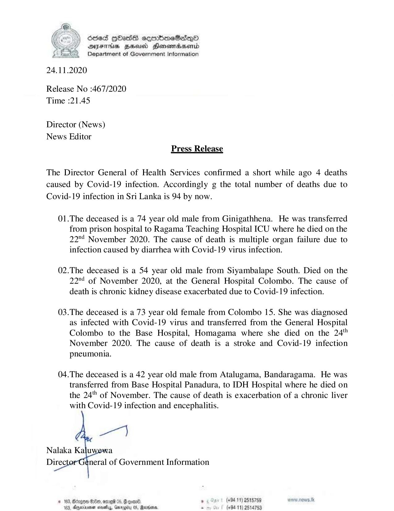

# Press Release - 2020.11.24 - Covid 19 infection death rises to 94 
Key: 0bbdcce417c665da6e6a8a907405d8b7 

---
```
6565 HHass semmbmcSdqQo
DFITHS HEU Honomradsertd
Department of Government Information

 

24.11.2020

Release No :467/2020
Time :21.45

Director (News)
News Editor
Press Release

The Director General of Health Services confirmed a short while ago 4 deaths
caused by Covid-19 infection. Accordingly g the total number of deaths due to
Covid-19 infection in Sri Lanka is 94 by now.

01.The deceased is a 74 year old male from Ginigathhena. He was transferred
from prison hospital to Ragama Teaching Hospital ICU where he died on the
22™ November 2020. The cause of death is multiple organ failure due to
infection caused by diarrhea with Covid-19 virus infection.

02.The deceased is a 54 year old male from Siyambalape South. Died on the
22™ of November 2020, at the General Hospital Colombo. The cause of
death is chronic kidney disease exacerbated due to Covid-19 infection.

03.The deceased is a 73 year old female from Colombo 15. She was diagnosed
as infected with Covid-19 virus and transferred from the General Hospital
Colombo to the Base Hospital, Homagama where she died on the 24'"
November 2020. The cause of death is a stroke and Covid-19 infection
pneumonia.

04.The deceased is a 42 year old male from Atalugama, Bandaragama. He was
transferred from Base Hospital Panadura, to IDH Hospital where he died on
the 24"" of November. The cause of death is exacerbation of a chronic liver
with Covid-19 infection and encephalitis.

 

# 163, Bergen He, omeW %, G goal. . (+8411) 2515759
163, Anarene seveby, Grrogiy 05, Rariane. . (+94 11) 2514753

```
