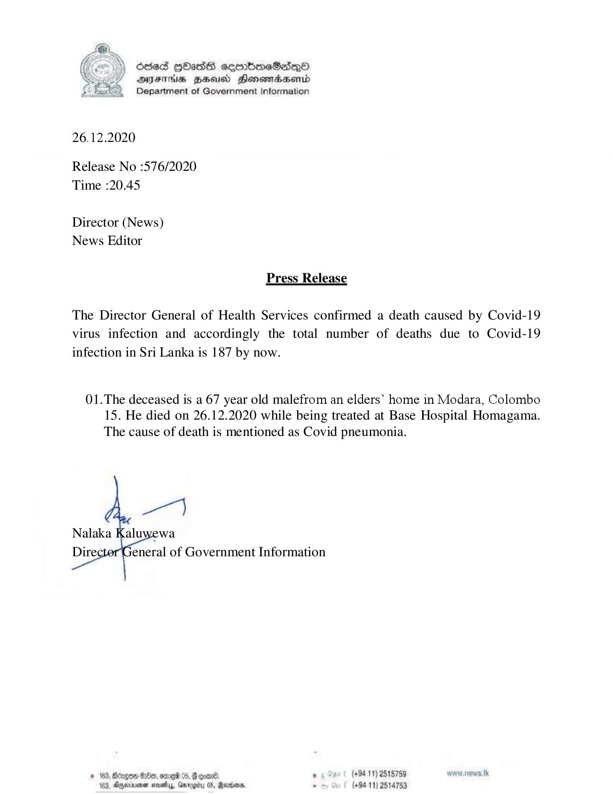

# Press Release - 2020.12.26 - Covid 19 infection deaths rises to 187 
Key: 0c2c39ac19427a9258feb585cdf08183 

---
```
6563 HOHasG sembmcSasqQo
DFTs BHsusd HensmasABentd
Department of Government Information

 

26.12.2020

Release No :576/2020
Time :20.45

Director (News)
News Editor

Press Release

The Director General of Health Services confirmed a death caused by Covid-19
virus infection and accordingly the total number of deaths due to Covid-19

infection in Sri Lanka is 187 by now.

01.The deceased is a 67 year old malefrom an elders’ home in Modara, Colombo
15. He died on 26.12.2020 while being treated at Base Hospital Homagama.
The cause of death is mentioned as Covid pneumonia.

 

# 163, Bcegon 00, ome 05, § con® , (+94 11) 2515759
163, Oneimenen seve, Grrogiy 0S, Maron, - (+94 11) 2514753

```
