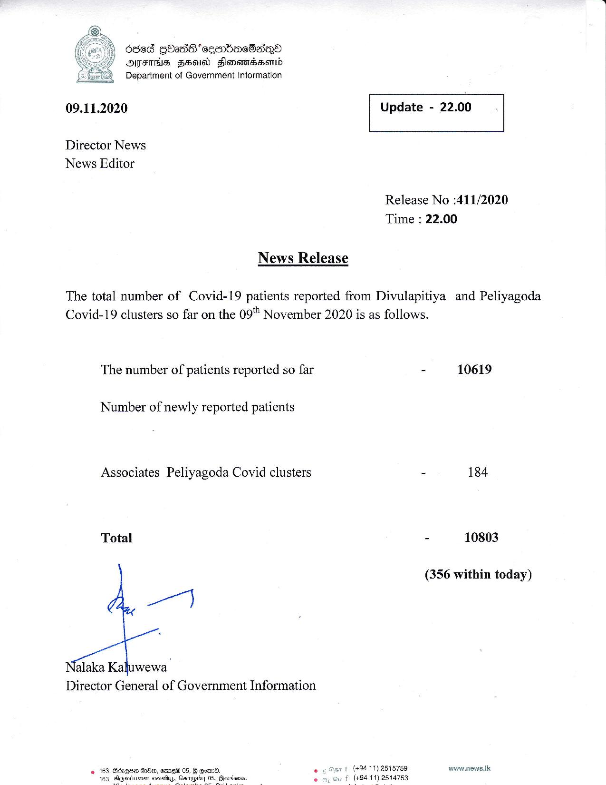

# Press Release - 2020.11.09 
Key: 0c59c38eb3530eeecc781b3812cd8022 

---
```
| 6868 gbadScesibacdaqo
ATS FHA Flonomssomd
Department of Government Information

 

 

09.11.2020 Update - 22.00

 

 

 

Director News
News Editor

Release No :411/2020
Time : 22.00

News Release

The total number of Covid-19 patients reported from Divulapitiya and Peliyagoda
Covid-19 clusters so far on the 09" November 2020 is as follows.

The number of patients reported so far - 10619

Number of newly reported patients

Associates Peliyagoda Covid clusters - 184
Total - 10803
(356 within today)

wet

jalaka Kaluwewa
Director General of Government Information

«183, Sirese GO, ames 05, G eomO. oe Asn t (494-11) 2615759 www.news.lk
163, Elupsciiemen aisusiy, 2 f (#9411) 2514753

   

```
