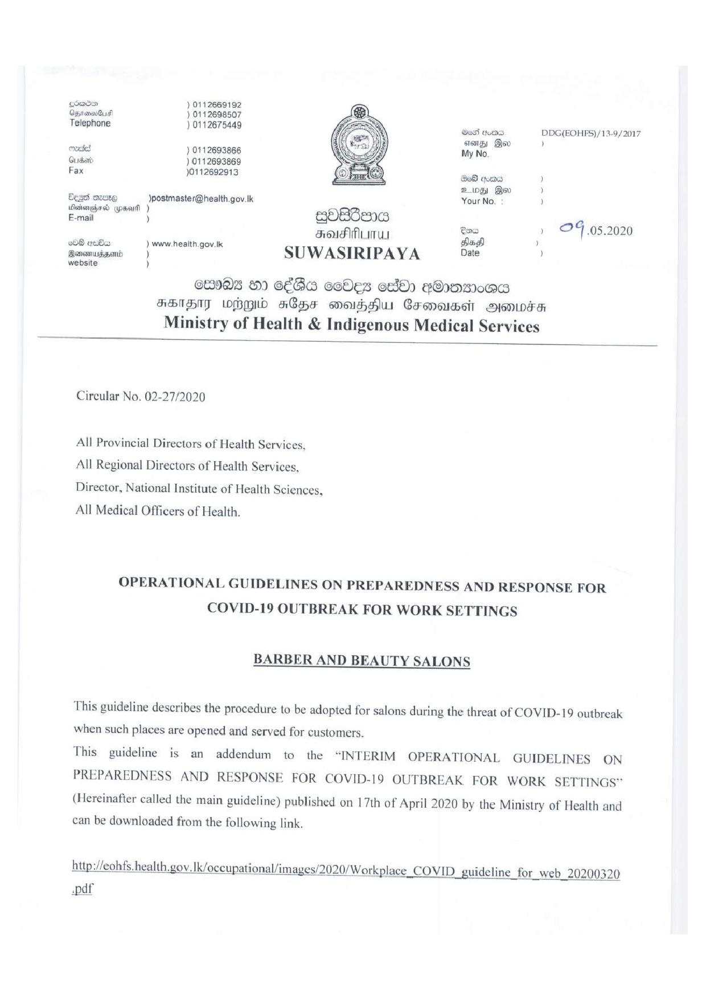

# Press Release - 2020.05.10 - Ministry of Health & Indigenous Medical Services 
Key: 0c80fcb290fb22e8cfa0f86dc588bf4b 

---
```
stato ) 0112669192

 

Osimatud ) 0112698507

Telephone ) 0112675449 eed wos DDG(EOHFS)/13.9/2017
sions) Boo ,

meted ) 0112693866 My No,

Gi rbert> ) 0112693869

Fax )0112692913 BA eee )
210g) Qo )

Bess mee )postmaster@health.gov.tk Your No. )

iGsitenehasd (pase ) o

=) Qokdana =
Bow » 24.05.2020

ROS ALATA Sad j
om 2 www. health gov. lk ~
Booniiams | ’ SUWASIRIPAYA be )
website )

Gw082 ©) 6€Ba osdes ok) e@Qomsr0ac
FSIS wg 4s6pe morhHu Cromaaei sons
Ministry of Health & Indigenous Medical Services

 

Circular No. 02-27/2020

All Provincial Directors of Health Services,
All Regional Directors of Health Services,
Director, National Institute of Health Sciences,
All Medical Officers of Health.

OPERATIONAL GUIDELINES ON PREPAREDNESS AND RESPONSE FOR
COVID-19 OUTBREAK FOR WORK SETTINGS

BARBER AND BEAUTY SALONS

 

This guideline describes the procedure to be adopted for salons during the threat of COVID-19 outbreak
when such places are opened and served for customers.

This guideline is an addendum to the “INTERIM OPERATIONAL GUIDELINES ON
PREPAREDNESS AND RESPONSE FOR COVID-19 OUTBREAK FOR WORK SETTINGS”

(Hereinafter called the main guideline) published on 17th of April 2020 by the Ministry of Health and
can be downloaded from the following link.

http://eohfs.health. gov. |k/occupational/images/2020/Workplace COVID guideline for web 20200320

-pdf

```
