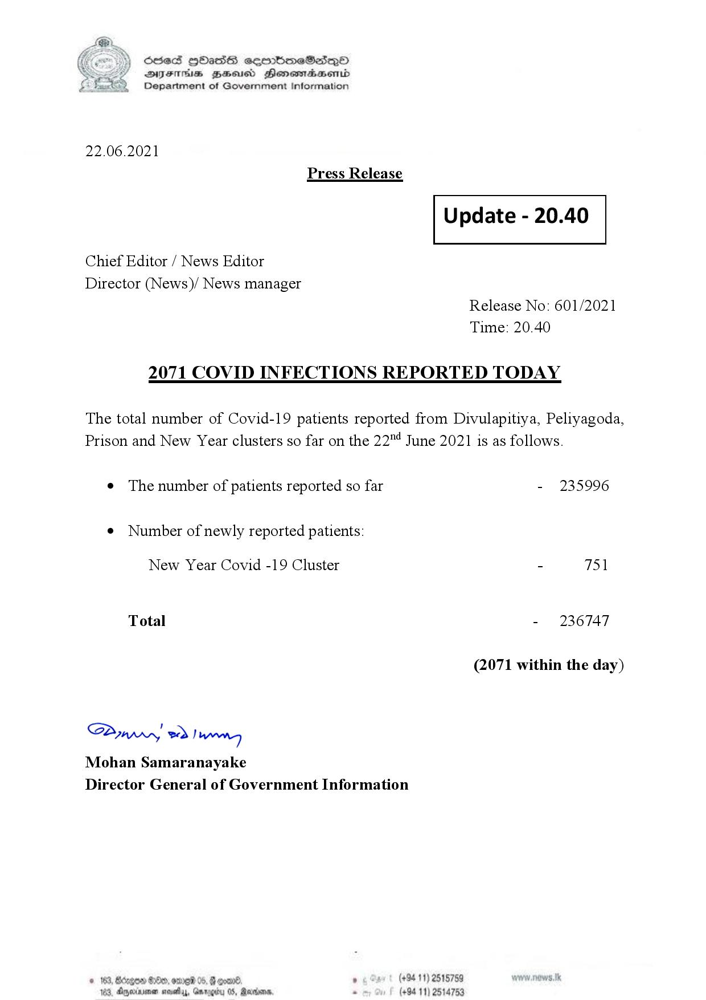

# Press Release - 2021.06.22 - Covid 19 infection report 
Key: 0d1d4b197f034dc18fa7a94d24570179 

---
```
(6 S) ScseS HOasdS cerrbmeSdQo
DFTs BHEosd Henewtaeasernid
Department of Government Information

 

22.06.2021
Press Release

Chief Editor / News Editor
Director (News)/ News manager

 

 

Update - 20.40

 

 

Release No: 601/2021
Time: 20.40

2071 COVID INFECTIONS REPORTED TODAY

The total number of Covid-19 patients reported from Divulapitiya, Peliyagoda,
Prison and New Year clusters so far on the 22 June 2021 is as follows.

e The number of patients reported so far

¢ Number of newly reported patients:

New Year Covid -19 Cluster

Total

Saw 2) won,
Mohan Samaranayake
Director General of Government Information

© 163, ong

 

- 235996

- 751

- 236747

(2071 within the day)

00, ome 05, § qoar® , (+94 11) 2515759

103, Ageinvemen wos, Garg 05, Randers. . (+94 11) 2514753

```
