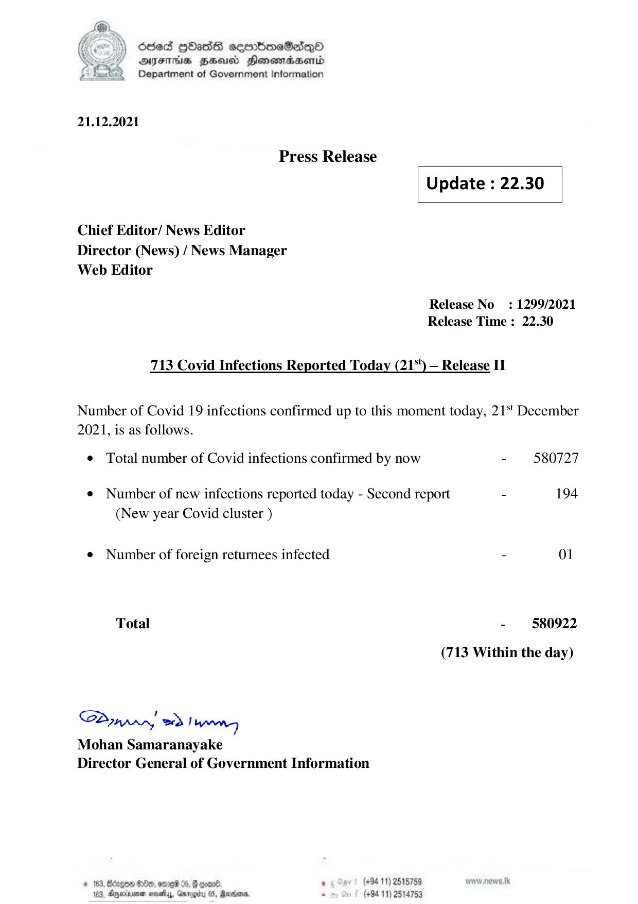

# Press Release - 2021.12.21 - Covid 19 Infection Report 
Key: 0e78c74eea6e939cd1ab4985ddb1c5f8 

---
```
) died Gass ceembeSsdqQo
AIFS FHA Honowmadsentd
2 Department of Government Information

  

21.12.2021

Press Release

 

Update : 22.30

 

 

 

Chief Editor/ News Editor
Director (News) / News Manager
Web Editor

Release No: 1299/2021
Release Time : 22.30

713 Covid Infections Reported Today (21%) — Release II

Number of Covid 19 infections confirmed up to this moment today, 21 December
2021, is as follows.

© Total number of Covid infections confirmed by now - 580727
¢ Number of new infections reported today - Second report - 194
(New year Covid cluster )
¢ Number of foreign returnees infected - 01
Total - 580922
(713 Within the day)

Sdn, ed Ngee
Mohan Samaranayake
Director General of Government Information

© 163, Bérge &0e9, ere 05, & qoan® “ (+94 11) 2515789
183, Dyyeriinen neve, Gmrogiy 05, Marans, - (+8411) 2514753

```
