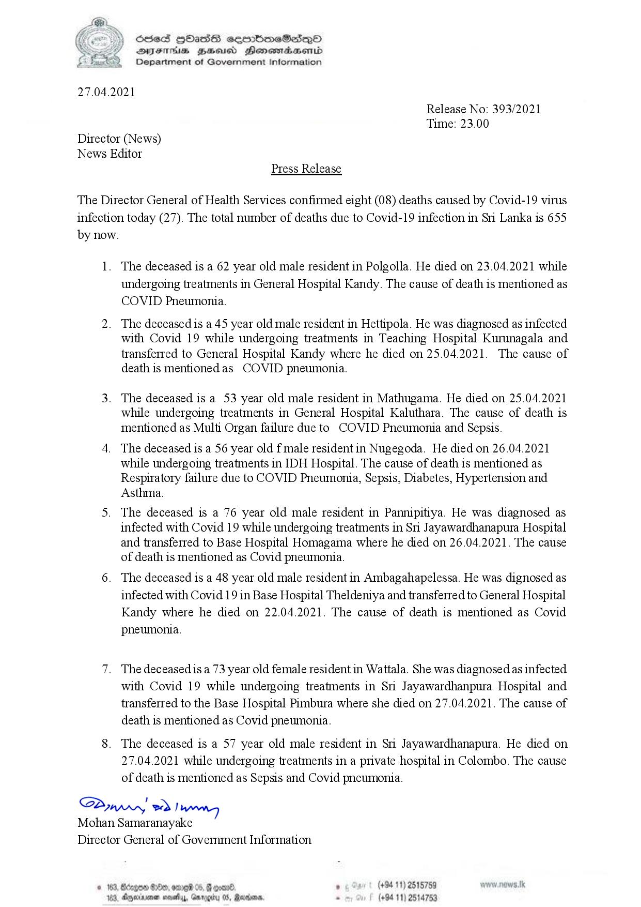

# Press Release - 2021.04.27 - Covid 19 Infection deaths 
Key: 105b63a87c3463a46601817f7e2fbb6e 

---
```
(4 ) Sed HOasG seembmeSsdqoO
‘ Sse geod Henosnadasomd
Department of Government Information

 

27.04.2021

Release No: 393/2021
Time: 23.00
Director (News)
News Editor
Press Release

The Director General of Health Services confirmed eight (08) deaths caused by Covid-19 virus
infection today (27). The total number of deaths due to Covid-19 infection in Si Lanka is 655
by now.

1. The deceased is a 62 year old male resident in Polgolla. He died on 23.04.2021 while
undergoing treatments in General Hospital Kandy. The cause of death is mentioned as
COVID Pneumonia.

2. The deceased is a 45 year old male resident in Hettipola. He was diagnosed as infected
with Covid 19 while undergoing treatments in Teaching Hospital Kurunagala and
transferred to General Hospital Kandy where he died on 25.04.2021. The cause of
death is mentioned as COVID pneumonia.

3. The deceased is a 53 year old male resident in Mathugama. He died on 25.04.2021
while undergoing treatments in General Hospital Kaluthara. The cause of death is
mentioned as Multi Organ failure due to COVID Pneumonia and Sepsis.

4. The deceased is a 56 year old f male resident in Nugegoda. He died on 26.04.2021
while undergoing treatments in IDH Hospital. The cause of death is mentioned as
Respiratory failure due to COVID Pneumonia, Sepsis, Diabetes, Hypertension and
Asthma.

5. The deceased is a 76 year old male resident in Pannipitiya. He was diagnosed as
infected with Covid 19 while undergoing treatments in Sri Jayawardhanapura Hospital
and transferred to Base Hospital Homagama where he died on 26.04.2021. The cause
of death is mentioned as Covid pneumonia.

6. The deceased is a 48 year old male resident in Ambagahapelessa. He was dignosed as
infected with Covid 19 in Base Hospital Theldeniya and transferred to General Hospital
Kandy where he died on 22.04.2021. The cause of death is mentioned as Covid
pneumonia.

7. The deceasedis a 73 year old female resident in Wattala. She was diagnosed as infected
with Covid 19 while undergoing treatments in Sri Jayawardhanpura Hospital and
transferred to the Base Hospital Pimbura where she died on 27.04.2021. The cause of
death is mentioned as Covid pneumonia.

8. The deceased is a 57 year old male resident in Sri Jayawardhanapura. He died on
27.04.2021 while undergoing treatments in a private hospital in Colombo. The cause
of death is mentioned as Sepsis and Covid pneumonia.

SP ed)
Mohan Samaranayake
Director General of Government Information

. (+94 11) 2515759 N $.Ik
(+94 11) 2514753

 

```
