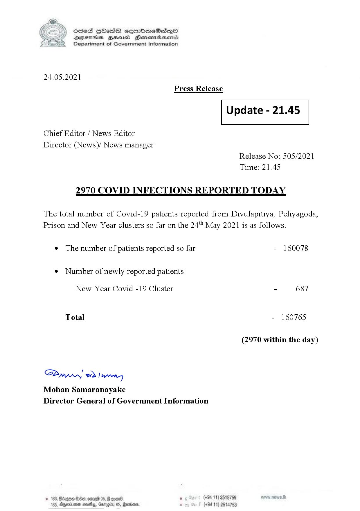

# Press Release - 2021.05.24 - Covid 19 Infection report 
Key: 11e573eb10faee527604823d67b430e3 

---
```
(6 S) ScseS HOasdS cerrbmeSdQo
DFTs BHEosd Henewtaeasernid
Department of Government Information

 

24.05.2021
Press Release

 

Update - 21.45

 

 

 

Chief Editor / News Editor

Director (News)/ News manager
Release No: 505/2021
Time: 21.45

2970 COVID INFECTIONS REPORTED TODAY

The total number of Covid-19 patients reported from Divulapitiya, Peliyagoda,
Prison and New Year clusters so far on the 24" May 2021 is as follows.

e The number of patients reported so far - 160078

¢ Number of newly reported patients:

New Year Covid -19 Cluster - 687
Total - 160765
(2970 within the day)

Saw 2) won,
Mohan Samaranayake
Director General of Government Information

(+94 11) 2515759
05, Marden 2 (+94 11) 2514753

© 163 Oe, ome 05. Fo
103, Ageinvener mosey, Gnrygd

 
 

```
