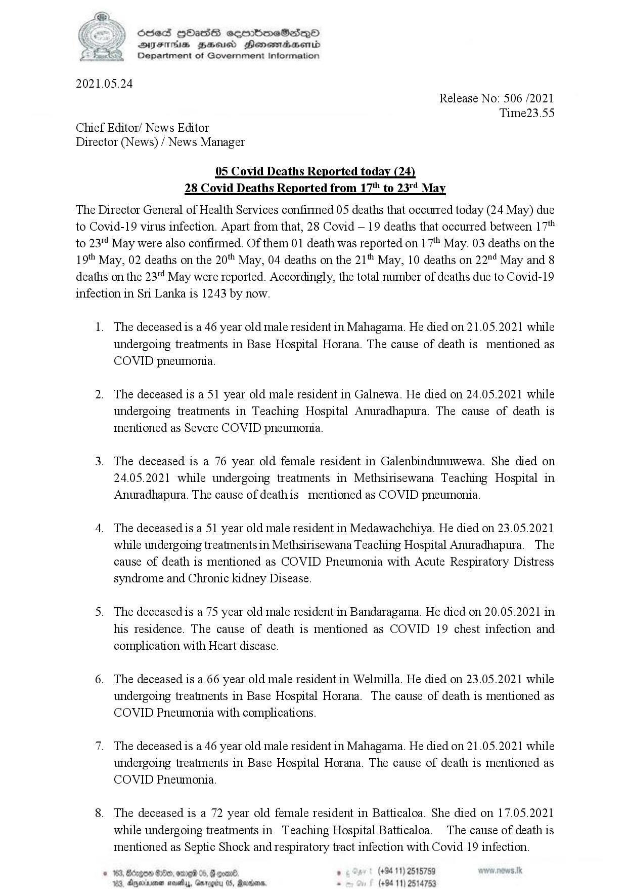

# Press Release - 2021.05.24 - Covid 19 infection deaths 
Key: 12ce7f5ae5f3900a32ac9b7084a5dca5 

---
```
ee 3) SOSed HOass eqmbmeSas—QO
SVsThis gZeeicd Henosradasombd
Department of Government Information

 

2021.05.24
Release No: 506 /2021
Time23.55
Chief Editor/ News Editor
Director (News) / News Manager

05 Covid Deaths Reported today (24
28 Covid Deaths Reported from 17" to 23" May

The Director General of Health Services confirmed 05 deaths that occurred today (24 May) due
to Covid-19 virus infection. Apart from that, 28 Covid — 19 deaths that occurred between 17"
to 23 May were also confirmed. Of them 01 death was reported on 17" May. 03 deaths on the
19" May, 02 deaths on the 20" May, 04 deaths on the 21" May, 10 deaths on 22" May and 8
deaths on the 23"! May were reported. Accordingly, the total number of deaths due to Covid-19
infection in Sri Lanka is 1243 by now.

1. The deceased is a 46 year old male resident in Mahagama. He died on 21.05.2021 while
undergoing treatments in Base Hospital Horana. The cause of death is mentioned as
COVID pneumonia.

2. The deceased is a 51 year old male resident in Galnewa. He died on 24.05.2021 while
undergoing treatments in Teaching Hospital Anuradhapura. The cause of death is
mentioned as Severe COVID pneumonia.

3. The deceased is a 76 year old female resident in Galenbindunuwewa. She died on
24.05.2021 while undergoing treatments in Methsirisewana Teaching Hospital in
Anuradhapura. The cause of deathis mentioned as COVID pneumonia.

4. The deceased is a 51 year old male resident in Medawachchiya. He died on 23.05.2021
while undergoing treatments in Methsirisewana Teaching Hospital Anuradhapura. The
cause of death is mentioned as COVID Pneumonia with Acute Respiratory Distress
syndrome and Chronic kidney Disease.

5. The deceased is a 75 year old male resident in Bandaragama. He died on 20.05.2021 in
his residence. The cause of death is mentioned as COVID 19 chest infection and
complication with Heart disease.

6. The deceased is a 66 year old male resident in Welmilla. He died on 23.05.2021 while
undergoing treatments in Base Hospital Horana. The cause of death is mentioned as
COVID Pneumonia with complications.

7. The deceased is a 46 year old male resident in Mahagama. He died on 21.05.2021 while
undergoing treatments in Base Hospital Horana. The cause of death is mentioned as
COVID Pneumonia.

8. The deceased is a 72 year old female resident in Batticaloa. She died on 17.05.2021
while undergoing treatments in Teaching Hospital Batticaloa. The cause of death is
mentioned as Septic Shock and respiratory tract infection with Covid 19 infection.

. (+94 11) 2515759
(+94 11) 2514753

 

```
