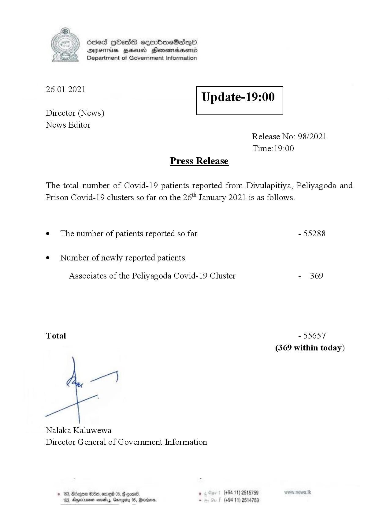

# Press Release - 2021.01.26 
Key: 138e99a16a1146fb6efb5c223cadbc3c 

---
```
Ssed HbasG sembmeSadqo
DAIS BHU Honomasentd
Department of Government Information

 

 

26.01.2021

Update-19:00

 

 

 

Director (News)
News Editor
Release No: 98/2021
Time:19:00
Press Release

The total number of Covid-19 patients reported from Divulapitiya, Peliyagoda and
Prison Covid-19 clusters so far on the 26" January 2021 is as follows.
e¢ The number of patients reported so far - 55288

¢ Number of newly reported patients

Associates of the Peliyagoda Covid-19 Cluster - 369

Total - 55657
(369 within today)

Nalaka Kaluwewa
Director General of Government Information

© 163, Bzgow #180, ome 05, G coal , (+94 11) 2515759
183, Aqexrrsna sesety, Gnrogiru 05, Rares - (+94 11) 2514753

```
