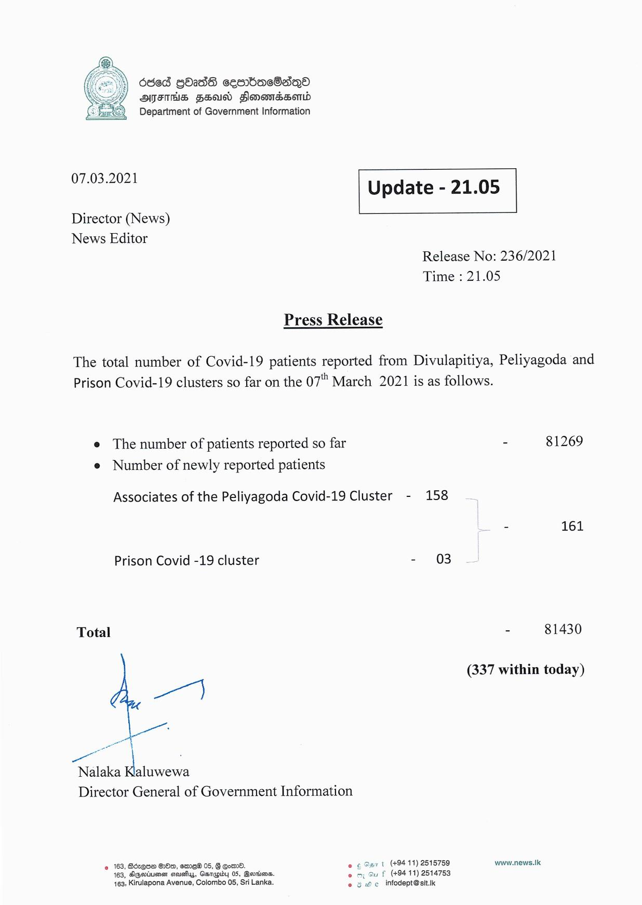

# Press Release - 2021.03.07 
Key: 13caaf9f6d7e622fd28ead2c2fa66bfe 

---
```
dded GOasdG cembacSaqo
AIFS FSU Slonomadsond
Department of Government Information

 

 

07.03.2021 Update - 21.05

 

 

 

Director (News)
News Editor

Release No: 236/2021
Time : 21.05

Press Release

The total number of Covid-19 patients reported from Divulapitiya, Peliyagoda and
Prison Covid-19 clusters so far on the 07" March 2021 is as follows.

e The number of patients reported so far - 81269
e Number of newly reported patients

Associates of the Peliyagoda Covid-19 Cluster - 158

- 161

Prison Covid -19 cluster - 03

Total - 81430

(337 within today)

on")

Nalaka Kaluwewa
Director General of Government Information

9 163, BézQoH G0, exe 05, G om. ec Sur t (49411) 2518759 www.news.k
163, Ageiumen saucy, Garagiby 05, Beorions. uf (494 11) 2514753
463, Kirulapona Avenue, Colombo 05, Sri Lanka.  infodept@stt.ik

  

```
