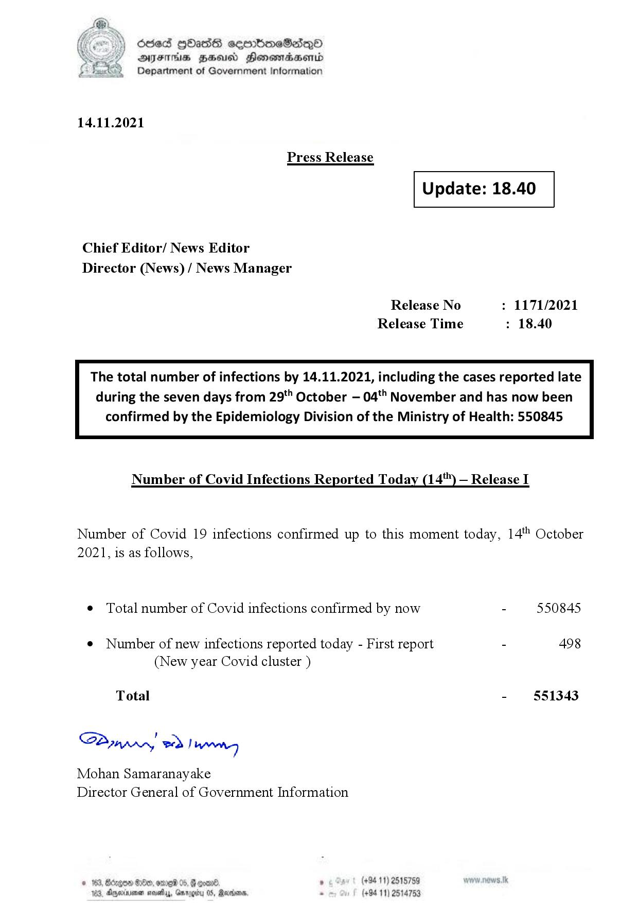

# Press Release - 2021.11.14 
Key: 149772b6cab36d3cdb39815ce383f182 

---
```
6863 GOasds sembmeSadqQo
AIFS HSA Honomasentd
Department of Government Information

 

14.11.2021

Press Release

 

Update: 18.40

 

 

 

Chief Editor/ News Editor
Director (News) / News Manager

Release No : 1171/2021
Release Time : 18.40

The total number of infections by 14.11.2021, including the cases reported late
during the seven days from 29" October — 04'" November and has now been

confirmed by the Epidemiology Division of the Ministry of Health: 550845

 

Number of Covid Infections Reported Today (14'") — Release I

Number of Covid 19 infections confirmed up to this moment today, 14" October
2021, is as follows,

¢ Total number of Covid infections confirmed by now - 550845

¢ Number of new infections reported today - First report - 498
(New year Covid cluster )

Total - 551343

SPynprn wd! weng

Mohan Samaranayake
Director General of Government Information

. (+94 11) 2515759
(+94 11) 2514753

    

103, Dgexrenen seve, GarogH

```
