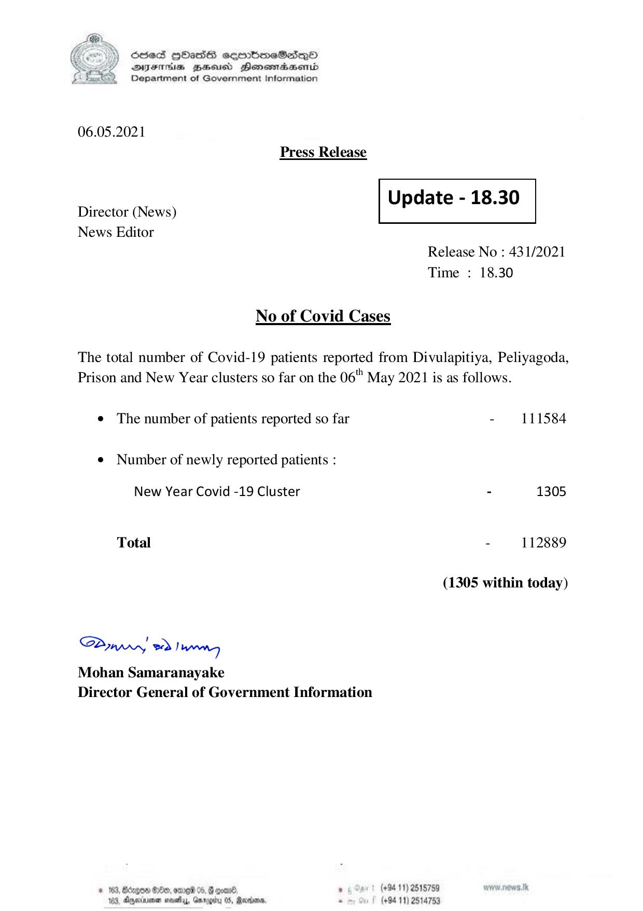

# Press Release - 2021.05.06 
Key: 14acd5d930e5c3390d8278dc346b0fb9 

---
```
) ScdeS HOadS cermbmeSsdQo
DVEFIHS HHosd Honomabsenid
Department of Government Information

 

06.05.2021
Press Release

 

Update - 18.30

 

 

Director (News)
News Editor

 

Release No : 431/2021
Time : 18.30

No of Covid Cases

The total number of Covid-19 patients reported from Divulapitiya, Peliyagoda,
Prison and New Year clusters so far on the 06" May 2021 is as follows.

¢ The number of patients reported so far - 111584

¢ Number of newly reported patients :

New Year Covid -19 Cluster - 1305
Total - 112889
(1305 within today)

Saw 2) wong
Mohan Samaranayake
Director General of Government Information

© 162; Bcapo0 €:80, ene 05, 8 cxene ‘ (+94 11) 2518759
163, Ageiune neatly, Gargity 05, Rann. - (+94 11) 2514753

```
