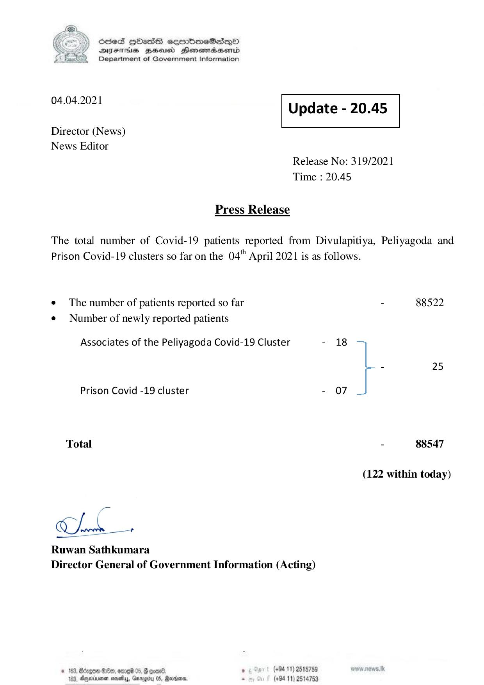

# Press Release - 2021.04.04 
Key: 14e35f5421e78a5d72452d84d92777a1 

---
```
) ScdeS HOadS cermbmeSsdQo
DVEFIHS HHosd Honomabsenid
Department of Government Information

 

 

04.04.2021 Update - 20.45

 

 

 

Director (News)

News Editor
Release No: 319/2021
Time : 20.45

Press Release

The total number of Covid-19 patients reported from Divulapitiya, Peliyagoda and
Prison Covid-19 clusters so far on the 04" April 2021 is as follows.

e The number of patients reported so far - 88522
¢ Number of newly reported patients
Associates of the Peliyagoda Covid-19 Cluster - 18
- 25
Prison Covid -19 cluster - 07
Total - 88547
(122 within today)

ne +

Ruwan Sathkumara
Director General of Government Information (Acting)

© 163, Borgo #200, ome 05, & ooan® , (+84 11) 2515759
183, Aperinsna sasety, Gnrogiry 05, Racers - (+94 11) 2514753

```
