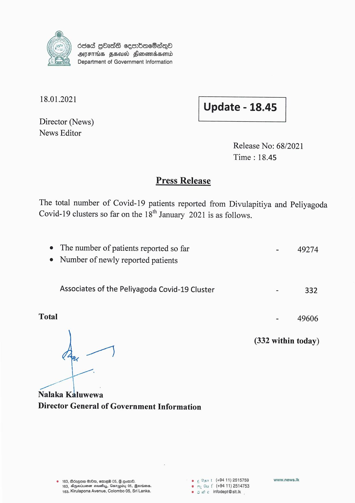

# Press Release - 2021.01.18 
Key: 151ad9de8c6314658f342f8a0b0292d0 

---
```
636d GOSS cemmbdacOasqQo
AISIHS FSU HonomBserid
Department of Government Information

 

 

18.01.2021 Update - 18.45

 

 

 

Director (News)

News Editor
Release No: 68/2021
Time : 18.45

Press Release

The total number of Covid-19 patients reported from Divulapitiya and Peliyagoda
Covid-19 clusters so far on the 18" January 2021 is as follows.

e The number of patients reported so far - 49274
e Number of newly reported patients

Associates of the Peliyagoda Covid-19 Cluster - 332

Total : 49606

(332 within today)

aon)

wee

—

Nalaka Kaluwewa
Director General of Government Information

© 163, Bdzqse Ow, eemeW 05, G @omO. © ¢ Sart (+94 11) 2515759 www.news.lk
163, Agariiuenen sevaliys, Ganugiby 05, Qernims. @ my Gu f (+94 11) 2514753
463, Kirulapona Avenue, Colombo 05, Sri Lanka. © § We infodept@stt.ik

```
