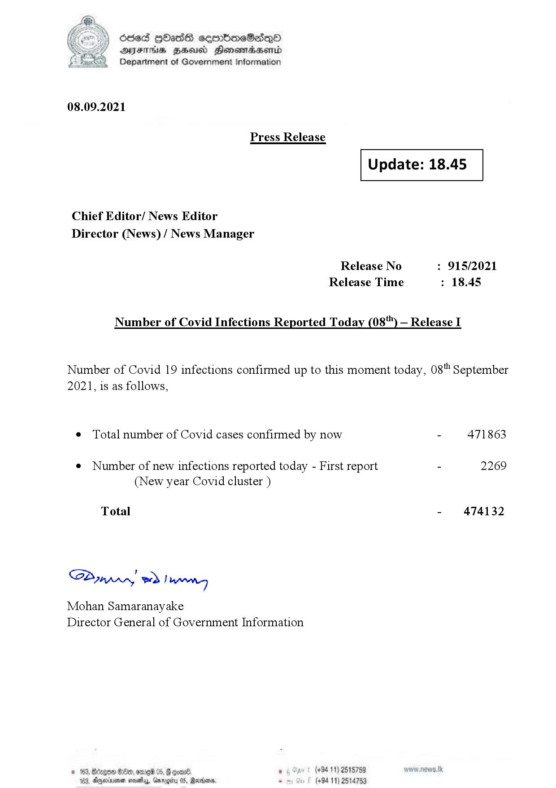

# Press Release - 2021.09.08 
Key: 153c13ccd332ba1dd3cc29ef2c44ce4a 

---
```
(i) Oded QOass seenboeSaiQo
DFS HHS Honsmnadaerntd
Department of Government Information

 

08.09.2021

Press Release

 

Update: 18.45

 

 

 

Chief Editor/ News Editor
Director (News) / News Manager

Release No : 915/2021
Release Time : 18.45

Number of Covid Infections Reported Today (08") — Release I

Number of Covid 19 infections confirmed up to this moment today, 08" September
2021, is as follows,

¢ Total number of Covid cases confirmed by now - 471863

¢ Number of new infections reported today - First report - 2269
(New year Covid cluster )

Total - 474132

SP ynprn! wd! wong

Mohan Samaranayake
Director General of Government Information

© 163, Bdagoe 800, ore 05,  ooan®

. (+94 11) 2515759
163, Anexivenan novelas, Geog 5

(+94 11) 2514753

 

```
