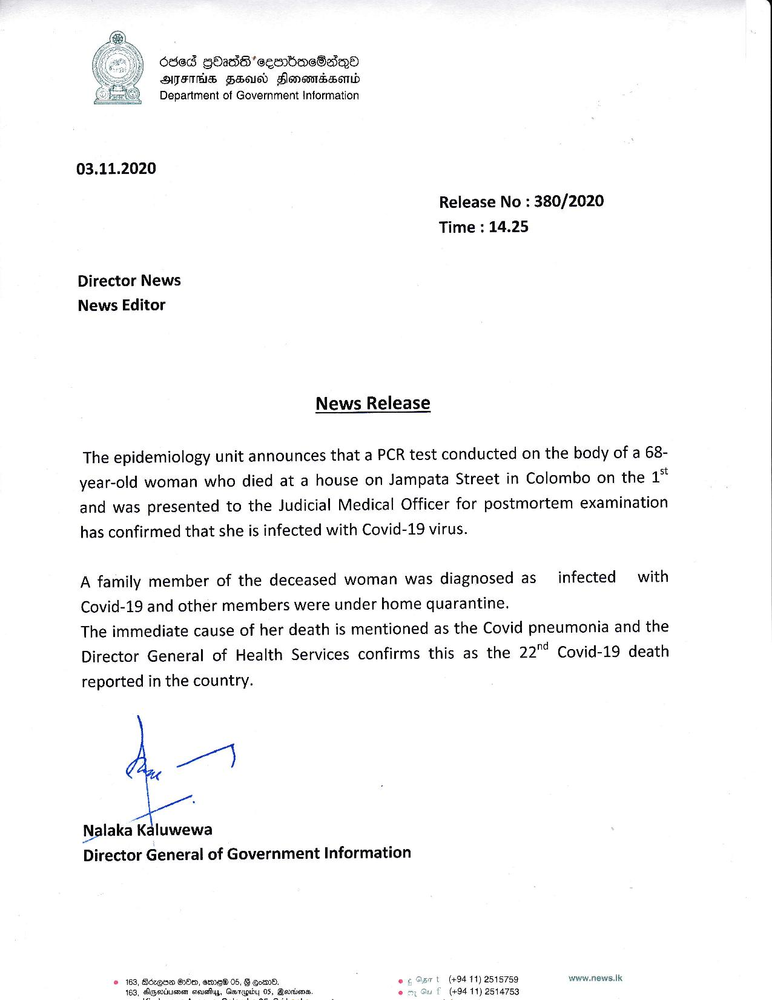

# Press Release - 2020.11.03 - Covid pneumonia was the leading cause of 22nd Covid 19 death reported in the country 
Key: 15dfb6fb6dfac9fa98c36275ad9d90b0 

---
```
Oded GOads’ seembacBaq®
AFIS FHald Fonewmabasomib
Department of Government Information

 

03.11.2020

Release No : 380/2020
Time : 14.25

Director News
News Editor

News Release

The epidemiology unit announces that a PCR test conducted on the body of a 68-
year-old woman who died at a house on Jampata Street in Colombo on the 1*
and was presented to the Judicial Medical Officer for postmortem examination
has confirmed that she is infected with Covid-19 virus.

A family member of the deceased woman was diagnosed as infected with
Covid-19 and other members were under home quarantine.

The immediate cause of her death is mentioned as the Covid pneumonia and the
Director General of Health Services confirms this as the 22" Covid-19 death
reported in the country.

we]

Nalaka Kaluwewa
Director General of Government Information

© 163, BézqEe OO, emreW 05, G Gom. er

(+94 11) 2515759 www.news.lk
163, Spee ceueti4s, Bovrienes,

(+94 11) 2514753

    

    

 

```
