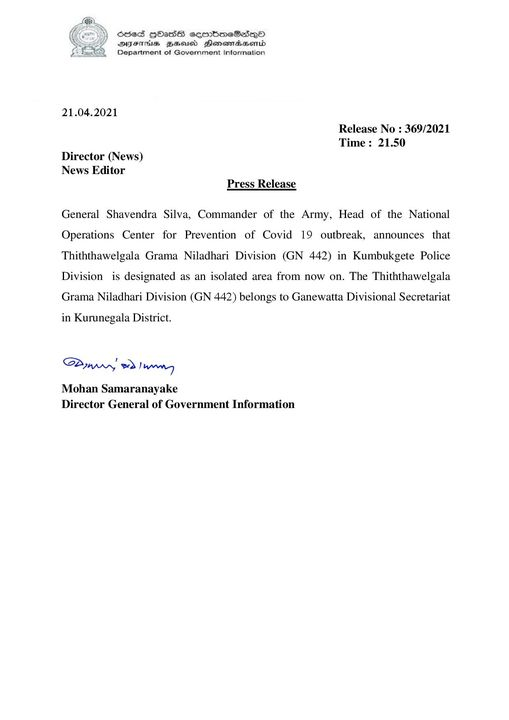

# Press Release - 2021.04.21 - Thiththawelgala Grama Niladhari Division isolated from this moment 
Key: 160b506e5b567bdb55d241701f591295 

---
```
 

21.04.2021

Release No : 369/2021
‘Time : 21.50
Director (News)
News Editor
Press Release

General Shavendra Silva, Commander of the Army, Head of the National
Operations Center for Prevention of Covid 19 outbreak, announces that
‘Thiththawelgala Grama Niladhari Division (GN 442) in Kumbukgete Police
Division is designated as an isolated area from now on. The Thiththawelgala
Grama Niadhari Di

 

 

jon (GN 42) belongs to Ganewatta Divisional Secretariat

in Kurunegala District,

Donnan) > orey
Mohan Samaranayake
Director General of Government Information

```
