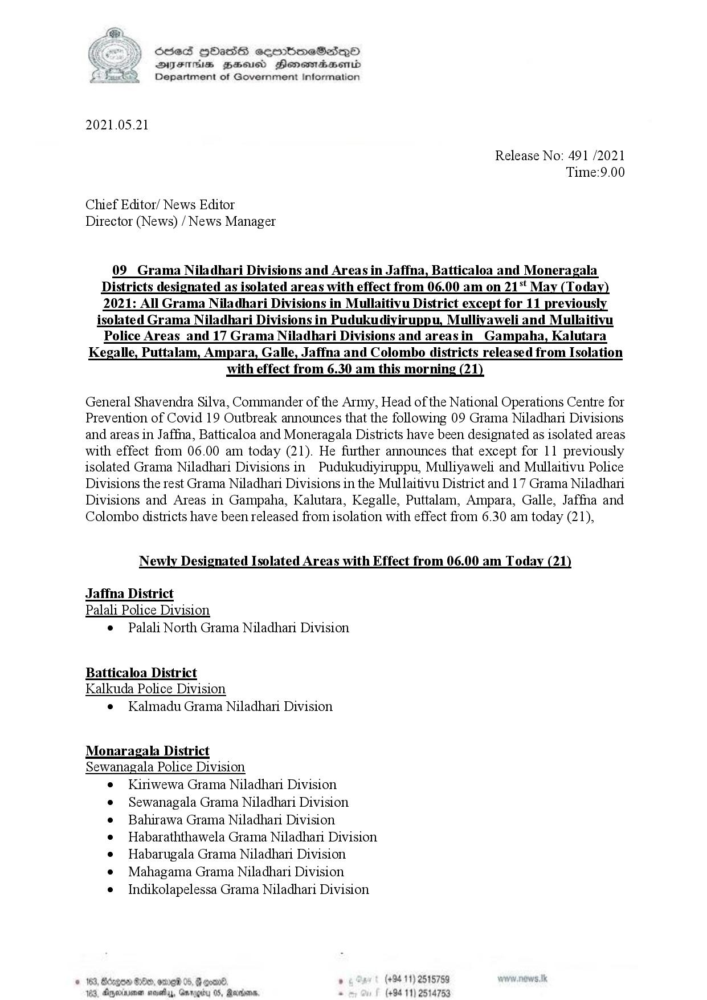

# Press Release - 2021.05.21 - Released from isolation and newly isolated areas 
Key: 164edb33b55e66b420f23d0e0b953dfc 

---
```
HC ) Sed HOHass cermbmeSadqQoO
. Y DYsErs Zeus Henesmabseonid
Department of Government Information

 

2021.05.21

Release No: 491 /2021
Time:9.00

Chief Editor/ News Editor
Director (News) / News Manager

09 Grama Niladhari Divisions and Areas in Jaffna, Batticaloa and Moneragala

Districts designated as isolated areas with effect from 06.00 am on 21‘t May (Today)
2021: All Grama Niladhari Divisions in Mullaitivu District except for 11 previously

isolated Grama Niladhari Divisions in Pudukudiyiruppu, Mulliyaweli and Mullaitivu
Police Areas_and 17 Grama Niladhari Divisions and areasin Gampaha, Kalutara

Kegalle, Puttalam, Ampara, Galle, Jaffna and Colombo districts released from Isolation

with effect from 6.30 am this morning (21)

General Shavendra Silva, Commander of the Army, Head of the National Operations Centre for
Prevention of Covid 19 Outbreak announces that the following 09 Grama Niladhari Divisions
and areas in Jaffna, Batticaloa and Moneragala Districts have been designated as isolated areas
with effect from 06.00 am today (21). He further announces that except for 11 previously
isolated Grama Niladhari Divisions in Pudukudiyiruppu, Mulliyaweli and Mullaitivu Police
Divisions the rest Grama Niladhari Divisions in the Mullaitivu District and 17 Grama Niladhari
Divisions and Areas in Gampaha, Kalutara, Kegalle, Puttalam, Ampara, Galle, Jaffna and
Colombo districts have been released from isolation with effect from 6.30 am today (21),

Newly Designated Isolated Areas with Effect from 06.00 am Today (21)

Jaffna District
Palali Police Division
e  Palali North Grama Niladhari Division.

Batticaloa District
Kalkuda Police Division

¢ Kalmadu Grama Niladhani Division

Monaragala District
Sewanagala Police Division
Kiniwewa Grama Niladhari Division.

Sewanagala Grama Niladhari Division
Bahirawa Grama Niladhari Division
Habaraththawela Grama Niladhari Division
Habarugala Grama Niladhari Division
Mahagama Grama Niladhari Division
Indikolapelessa Grama Niladhari Division

. (+84 11) 2515759
(+94 11) 2514753

    

```
