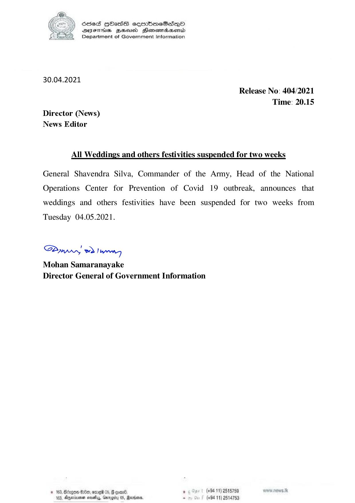

# Press Release - 2021.04.30 -All Weddings and other festivities suspended for two weeks 
Key: 16d7d5eb028326691160478ecf69bee6 

---
```
6856S HOAGSH sormbmeSasqo
DFTs Hess Henemadbasentd
Department of Government Information

 

30.04.2021
Release No: 404/2021
Time: 20.15
Director (News)
News Editor

All Weddings and others festivities suspended for two weeks

General Shavendra Silva, Commander of the Army, Head of the National
Operations Center for Prevention of Covid 19 outbreak, announces that
weddings and others festivities have been suspended for two weeks from

Tuesday 04.05.2021.

Saw 2) wry
Mohan Samaranayake
Director General of Government Information

. (+94 11) 2515789
(+94 11) 2514753

© 163, Bdegoe 80, omed
183, Dnexnenan neatly, Gary

   

 

```
